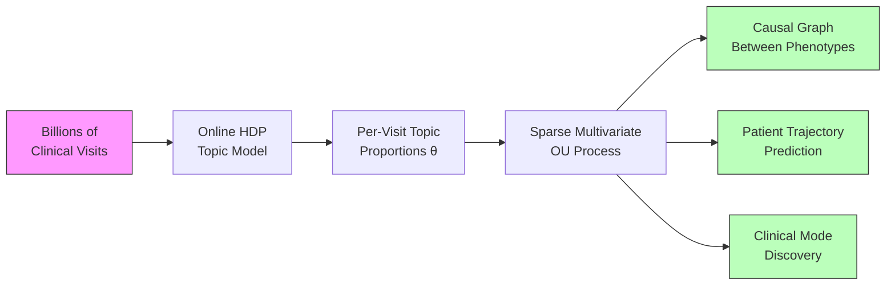
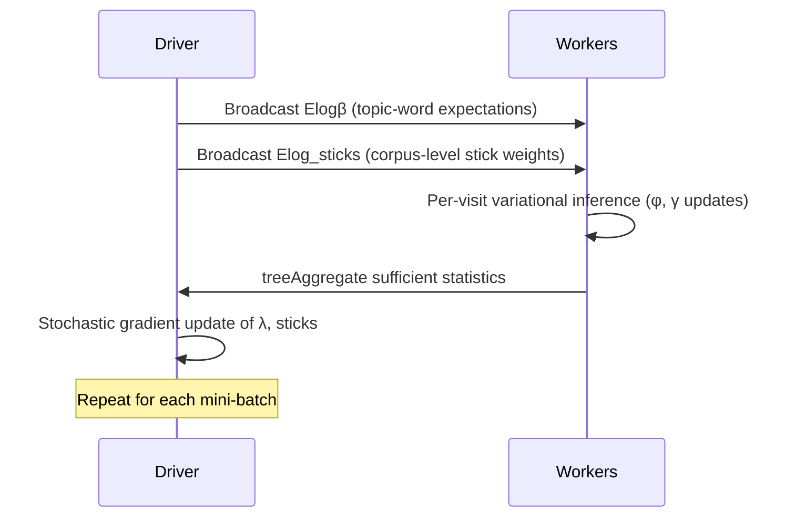
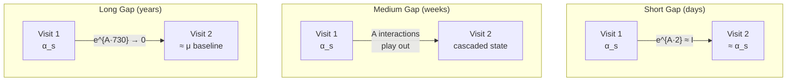
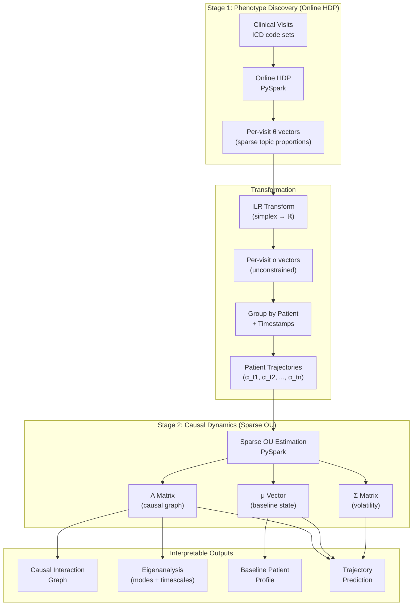
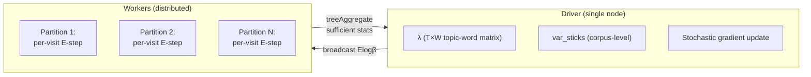
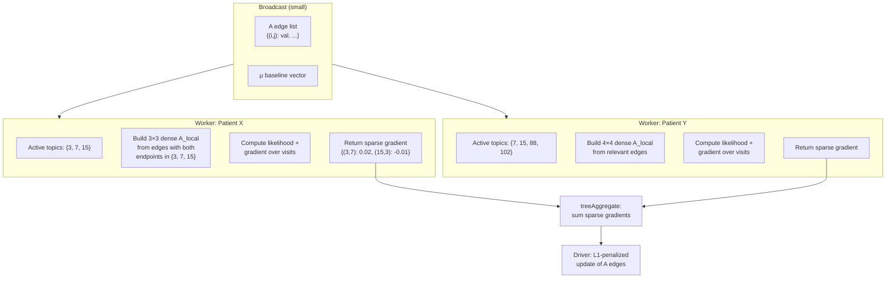
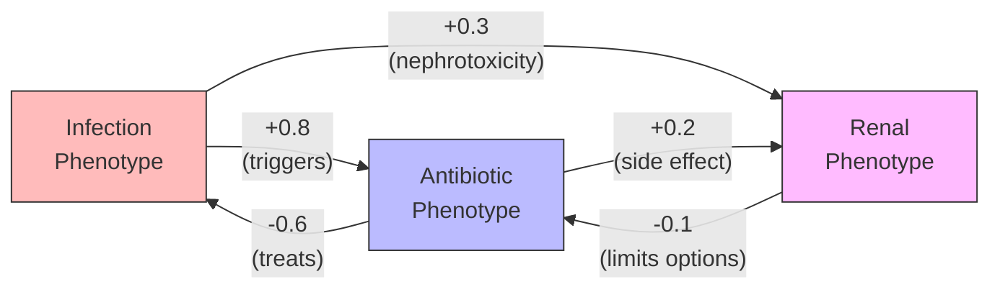

# Topic-State Modeling: Unsupervised Clinical Phenotype Discovery with Continuous-Time Causal Dynamics

## Executive Summary

Understanding how patients move through clinical states over time is fundamental to
improving care, predicting outcomes, and identifying causal relationships between
conditions. This document describes a two-stage modeling framework that:

1. **Discovers clinical phenotypes** from diagnosis code data using an Online
   Hierarchical Dirichlet Process (HDP) topic model — without predefining how many
   phenotypes exist or what they look like.
2. **Models patient dynamics** through those phenotypes over continuous time using a
   sparse multivariate Ornstein-Uhlenbeck (OU) process — capturing how clinical
   states evolve, interact, and cause downstream effects.

The framework produces directly interpretable outputs: a set of discovered clinical
phenotypes (clusters of co-occurring diagnoses), a causal interaction graph between
phenotypes, characteristic timescales of recovery and progression, and per-patient
predictive trajectories.

The entire pipeline runs in **pure PySpark with NumPy/SciPy** — no Scala, no custom
JVM code, no special cluster permissions. Both stages use Spark's distributed
computation effectively, scaling to billions of clinical visits and hundreds of
discovered phenotypes.



**Key properties:**

- **No predefined phenotypes.** The HDP discovers how many clinical phenotypes exist
  and what they contain, directly from co-occurrence patterns in diagnosis codes.
- **Continuous time.** Irregular visit spacing is handled natively — no need to bin
  time into arbitrary windows.
- **Causal structure.** The learned interaction matrix reveals which phenotypes drive
  or inhibit other phenotypes, with explicit timescales.
- **Generative and predictive.** The model can simulate future patient trajectories
  and provide probabilistic forecasts at any time horizon.
- **Scalable.** Both stages distribute computation across Spark workers. The natural
  sparsity of clinical data (few active phenotypes per patient) keeps per-patient
  computation small even with hundreds of global phenotypes.

---

## Background & Rationale

### Topic Models for Clinical Data

Topic models discover latent structure in collections of discrete data. Originally
developed for text (where "topics" are clusters of co-occurring words), they apply
naturally to clinical visit data:

| Text Domain | Clinical Domain |
|---|---|
| Document | Clinical visit (ED encounter, inpatient stay, office visit) |
| Word | Diagnosis code (ICD-10) |
| Topic | Clinical phenotype (a pattern of co-occurring diagnoses) |
| Topic proportion | How much each phenotype characterizes a given visit |

A visit with codes `{E11.9, I10, E78.5, Z79.84}` (type 2 diabetes, hypertension,
hyperlipidemia, long-term insulin use) would load heavily on a "metabolic syndrome
management" phenotype. The model discovers these phenotypes unsupervised from
co-occurrence patterns across millions of visits.

**Why visits are the right document unit.** A clinical visit is a natural,
semantically coherent bundle of diagnoses — it captures what is going on with a
patient at a point in time. Alternative slicing strategies (per-day, per-week,
per-patient) either produce documents too sparse to infer topics from, or collapse
temporal structure that we want to preserve for the dynamics stage.

### Why Existing Dynamic Topic Models Don't Fit

The Dynamic Topic Model (DTM; Blei & Lafferty, 2006) extends LDA by chaining topics
through a state space model over time:

$$\beta_{t,k} \mid \beta_{t-1,k} \sim \mathcal{N}(\beta_{t-1,k},\; \sigma^2 I)$$

where $\beta_{t,k}$ is the natural parameter of the word distribution for topic $k$
at time slice $t$. This is elegant but problematic for clinical data:

1. **Fixed number of topics.** DTM requires specifying $K$ in advance. For
   exploratory analysis of clinical phenotypes, we don't know how many exist — and
   the answer varies by patient population. The Hierarchical Dirichlet Process (HDP)
   discovers $K$ from the data.

2. **Discrete, non-overlapping time slices.** DTM bins documents by time period.
   Clinical visits occur at irregular, patient-specific times.

3. **Independent topic evolution.** Each topic evolves as an independent random walk.
   There is no mechanism for one topic to influence another — but in clinical data,
   topic interactions are the primary phenomenon of interest (infection leads to
   organ damage, treatment suppresses symptoms).

4. **Wavelet regression discards multi-scale signal.** DTM's wavelet-based
   variational inference uses thresholding to separate signal from noise, zeroing out
   small wavelet coefficients. In clinical data, meaningful dynamics span all
   timescales — from acute events (days) to seasonal patterns (months) to chronic
   progression (years). Thresholding would discard real signal.

### The Key Insight: Decouple Discovery from Dynamics

Rather than building a single monolithic model, we separate concerns:

- **Stage 1 (HDP):** Discover *what the clinical phenotypes are* — a static,
  atemporal problem. What patterns of diagnoses co-occur?
- **Stage 2 (OU):** Model *how patients move through phenotypes over time* — a
  continuous-time dynamics problem. How do phenotype states evolve and interact?

This separation is both practical and principled:

- **Each stage uses the best tool for its subproblem.** HDP for nonparametric
  discrete mixture modeling; OU for continuous-time multivariate dynamics.
- **Each stage is independently interpretable and debuggable.** You can inspect and
  validate the discovered phenotypes before modeling their dynamics.
- **The stages communicate through a clean interface:** per-visit topic proportion
  vectors $\theta_d$.

---

## Model Architecture

### Stage 1: Online HDP for Clinical Phenotype Discovery

The Hierarchical Dirichlet Process (Teh et al., 2006) is a nonparametric Bayesian
topic model. Unlike LDA, which requires a fixed number of topics $K$, the HDP uses a
stick-breaking process to let the data determine how many topics are needed.

**Generative process for a visit:**

1. Draw topic proportions $\theta_d$ from a Dirichlet Process
2. For each diagnosis code in the visit:
   - Draw a topic assignment $z_{d,n} \sim \text{Mult}(\theta_d)$
   - Draw a diagnosis code $w_{d,n} \sim \text{Mult}(\phi_{z_{d,n}})$

where $\phi_k$ is the diagnosis distribution for phenotype $k$.

**Online variational inference** (Wang, Paisley & Blei, 2011) processes the corpus
in mini-batches, making it suitable for very large datasets. Each iteration:



**Key parameters:**

| Parameter | Symbol | Role |
|---|---|---|
| Corpus-level truncation | $T$ | Upper bound on number of topics (HDP discovers actual count $\leq T$) |
| Document-level truncation | $K$ | Upper bound on topics per document |
| Topic concentration | $\gamma$ | Controls how many corpus-level topics are used |
| Document concentration | $\alpha$ | Controls how many topics each visit uses |
| Learning rate | $\kappa, \tau$ | Controls stochastic gradient step size: $\rho_t = (t + \tau)^{-\kappa}$ |

**Output:** For each visit $d$, a sparse topic proportion vector
$\theta_d \in \mathbb{R}^T$ where most entries are near zero (a visit with 5-10
diagnosis codes typically loads on 3-8 phenotypes).

### Stage 2: Sparse Multivariate OU for Patient Dynamics

Given the per-visit topic proportions from Stage 1, we model each patient's
trajectory through phenotype space as a continuous-time stochastic process.

**Notation.** The HDP uses a truncation level $T$ (the upper bound on corpus-level
topics). In practice, only $K \leq T$ topics carry meaningful weight. From this point
forward, $K$ refers to the number of active phenotypes retained for the dynamics
stage — typically 100-300 after discarding negligible topics.

**Log-ratio transformation.** Topic proportions $\theta_d$ live on the simplex
(non-negative, sum to 1). We apply the isometric log-ratio (ILR) transform from
compositional data analysis to map them to unconstrained $\mathbb{R}^{K-1}$:

$$\alpha_d = \text{ILR}(\theta_d)$$

**The OU process.** Each patient's transformed state evolves as:

$$d\alpha_t = A(\mu - \alpha_t)\,dt + \Sigma\,dW_t$$

where:

| Symbol | Meaning |
|---|---|
| $\alpha_t \in \mathbb{R}^{K-1}$ | Patient's phenotype state at time $t$ |
| $\mu \in \mathbb{R}^{K-1}$ | Long-run baseline ("healthy equilibrium") |
| $A \in \mathbb{R}^{(K-1) \times (K-1)}$ | Drift matrix — **the causal interaction structure** |
| $\Sigma$ | Diffusion matrix (noise/volatility) |
| $W_t$ | Standard Brownian motion |

The OU process is mean-reverting: deviations from baseline $\mu$ are pulled back at
rates determined by $A$. The off-diagonal entries of $A$ capture how one phenotype's
elevation drives changes in another.

**Closed-form transition density.** The conditional distribution between two
observations at times $s$ and $t$ is Gaussian:

$$\alpha_t \mid \alpha_s \sim \mathcal{N}\!\Big(\mu + e^{A(t-s)}(\alpha_s - \mu),\;\; \Gamma(t-s)\Big)$$

where $\Gamma(\Delta t) = \int_0^{\Delta t} e^{Au}\,\Sigma\Sigma^\top\, e^{A^\top u}\,du$.

This means:
- **Short time gap ($\Delta t$ small):** $e^{A \Delta t} \approx I + A\Delta t$ —
  the state barely moves. Prediction is close to $\alpha_s$.
- **Long time gap ($\Delta t$ large):** $e^{A \Delta t} \to 0$ — the state has
  reverted toward $\mu$. Prediction is close to baseline.
- **Medium gap:** The interactions in $A$ play out — cascading effects between
  phenotypes unfold according to the learned dynamics.

The variance $\Gamma(\Delta t)$ also grows with the gap, correctly reflecting
increased uncertainty for patients not seen recently.



### How the Stages Connect



---

## Computational Design

### HDP: Distributed Variational Inference

The Online HDP follows Spark MLlib's OnlineLDA distribution pattern — the same
architecture that Spark uses for its built-in LDA implementation.

**What runs where:**



**Per-iteration data flow:**

1. **Broadcast** ($O(T \times V)$): Driver sends current topic-word expectations
   $E[\log \beta]$ to all workers.
2. **mapPartitions** ($O(\text{docs} \times K \times V_{\text{doc}})$): Each worker
   runs variational inference for its visits. For each visit, iterate between:
   - $\phi$ updates (document-level topic assignments)
   - $\gamma$ updates (document-level topic proportions)
   - $\text{var\_phi}$ updates (corpus-level topic assignments)
3. **treeAggregate** ($O(T \times V)$, tree depth 2): Workers sum sufficient
   statistics and send the aggregated result to the driver.
4. **Driver M-step**: Stochastic natural gradient update of $\lambda$ and
   corpus-level sticks.

**Why not collect to driver (as the original Scala implementation does):**
The original intel-spark OnlineHDP implementation calls `chunk.collect()` to pull all
documents to the driver, then runs inference locally — wasting the cluster entirely.
Our port keeps the expensive per-document computation on workers, following the same
pattern that Spark MLlib's own `OnlineLDAOptimizer` uses: broadcast model, distributed
E-step, tree-aggregated statistics.

### OU: Distributed Sparse Estimation

The OU estimation exploits two forms of sparsity:

1. **Observation sparsity:** Each patient's visits only involve a small subset of the
   $K$ phenotypes ($\sim$5-20 active topics out of hundreds).
2. **Parameter sparsity:** Most phenotypes don't interact — $A$ is sparse (enforced
   via $L_1$ penalty).

**The $A$ matrix as an edge list.** Rather than storing and transmitting a dense
$K \times K$ matrix, $A$ is represented as a sparse dictionary of nonzero entries:

```
A_edges = {
    (topic_i, topic_j): coefficient,
    ...
}
# ~3,000-5,000 nonzero entries out of K² = 90,000 possible
```

**Per-patient computation uses only the relevant subblock:**



**Per-patient likelihood computation.** For a patient with visits at times
$t_1, t_2, \ldots, t_n$, the log-likelihood is:

$$\ell = \sum_{i=1}^{n-1} \log \mathcal{N}\!\left(\alpha_{t_{i+1}} \;\middle|\; \mu + e^{A_{\text{local}} \cdot \Delta t_i}(\alpha_{t_i} - \mu),\; \Gamma_{\text{local}}(\Delta t_i)\right)$$

where $A_{\text{local}}$ is the small dense subblock for this patient's active
topics, and $\Delta t_i = t_{i+1} - t_i$. The matrix exponential of a $15 \times 15$
matrix is trivial — NumPy computes it in microseconds.

**Estimation algorithm:**

For each iteration of the sparse OU estimator:

1. **Broadcast** the current edge list and $\mu$ (small — a few thousand floats).
2. **mapPartitions** over patients: for each patient, extract active topic subset,
   build dense subblock, compute log-likelihood and gradient contributions.
3. **treeAggregate** the sparse gradient dictionaries (sum matching keys).
4. **Driver**: proximal gradient step with $L_1$ penalty on $A$ — entries that
   shrink below threshold are dropped from the edge list.

### Scaling Analysis

**Stage 1 (HDP) scaling:**

| Dimension | Typical Value | Where It Appears |
|---|---|---|
| $V$ (vocabulary / ICD codes) | 10K-70K | Broadcast size: $T \times V$ |
| $T$ (topic truncation) | 150-300 | Broadcast size, sufficient stats |
| Documents (visits) | $10^6$-$10^9$ | Distributed across workers |
| Words per doc (codes per visit) | 5-20 | Per-doc computation: $O(K \times V_{\text{doc}})$ |

The broadcast of $E[\log \beta]$ at $T=300, V=50\text{K}$ is $\sim$120MB — well
within Spark broadcast limits. With billions of visits, workers stay busy because the
per-document E-step with $K=300$ topics involves substantial matrix computation.

Convergence with short documents (5-20 codes) is not a concern: individual visits
contribute weak per-document signal, but the global topic-word distributions $\lambda$
see aggregated co-occurrence statistics across millions of visits per mini-batch.

**Stage 2 (OU) scaling:**

| Dimension | Typical Value | Where It Appears |
|---|---|---|
| $K$ (active topics) | 100-300 globally | $A$ matrix size: $K \times K$ |
| Active topics per patient | 5-20 | Dense subblock size per patient |
| Patients | $10^5$-$10^7$ | Distributed across workers |
| Visits per patient | 3-50 | Per-patient sequential likelihood |
| Nonzero entries in $A$ | 3K-5K | Edge list broadcast size |

The per-patient computation involves matrix exponentials of $\sim$15$\times$15
matrices — negligible cost. The parallelism is across patients, which is abundant.
The $L_1$ sparsity of $A$ ensures that the broadcast, gradient, and update steps
all operate on $O(\text{nnz}(A))$ rather than $O(K^2)$.

**Nothing large or dense ever moves across the network.** The only dense matrices are
the small per-patient subblocks that are constructed and discarded on individual
workers.

### Technology Stack

| Component | Technology | Notes |
|---|---|---|
| Data distribution | PySpark RDDs | `mapPartitions`, `treeAggregate`, `broadcast` |
| Numerical computation | NumPy, SciPy | `digamma`, `gammaln`, `expm` (matrix exp), linear algebra |
| Log-ratio transform | NumPy (or `compositions` if in R post-hoc) | ILR transform is a matrix multiply |
| Sparse OU optimization | NumPy + custom proximal gradient | L1-penalized MLE with sparse gradient accumulation |
| No additional dependencies | — | No Scala, no JVM jars, no GraphX, no MLlib internals |

---

## Interpretable Outputs

### The $A$ Matrix as a Causal Graph

Each nonzero entry $A_{ij}$ in the drift matrix represents a directed influence:
phenotype $j$ being elevated affects the rate of change of phenotype $i$.



**Interpretation:**
- **Positive $A_{ij}$**: Phenotype $j$ promotes increases in phenotype $i$
- **Negative $A_{ij}$**: Phenotype $j$ suppresses phenotype $i$
- **Diagonal $A_{ii}$**: Self-reversion rate. Large negative = fast
  recovery/resolution. Near zero = chronic/persistent.
- **Zero $A_{ij}$** (absent from edge list): No direct influence (after controlling
  for all other phenotypes)

This is Granger causality in continuous time — $A_{ij} \neq 0$ means phenotype $j$
*predicts* changes in phenotype $i$, conditional on all other phenotypes.

### Eigenanalysis: Clinical Modes and Timescales

The eigenvalues and eigenvectors of $A$ reveal the system's fundamental modes of
dynamics:

**Eigenvalues $\lambda_i$** correspond to timescales:

$$\tau_i = -\frac{1}{\text{Re}(\lambda_i)}$$

gives the characteristic timescale of mode $i$. Fast eigenvalues ($\tau \sim$ days)
correspond to acute dynamics; slow eigenvalues ($\tau \sim$ years) correspond to
chronic progression.

**Eigenvectors** identify which *combinations* of phenotypes move together as a
coordinated unit. A single eigenvector might represent:

| Mode | Phenotypes Involved | Timescale |
|---|---|---|
| Acute decompensation | Heart failure ↑, Fluid overload ↑, Renal ↓ | ~days |
| Treatment response | Infection ↓, Inflammation ↓, Recovery ↑ | ~weeks |
| Chronic progression | Diabetes complications ↑, Vascular disease ↑ | ~years |
| Seasonal respiratory | Flu ↑, Pneumonia ↑, seasonal oscillation | ~months |

Even with 300 phenotypes, the system may have only 5-15 dominant modes — a massive
dimensionality reduction that reveals the fundamental clinical dynamics.

### Baseline Profile $\mu$

The vector $\mu$ represents the long-run equilibrium — what a "stable" patient looks
like in phenotype space. Deviations from $\mu$ are what the OU process models.

With covariate-dependent baselines:

$$\mu(\text{patient}) = \mu_0 + B \cdot [\text{age},\; \text{sex},\; \text{comorbidity index},\; \ldots]$$

different patient populations have different equilibria, and the dynamics in $A$ are
interpreted as "after accounting for demographics."

### Generative and Predictive Capacity

**Prediction.** Given a patient's visit history up to time $t$, the conditional
distribution of their state at any future time $t + \Delta t$ is Gaussian with known
mean and variance — no simulation required for point predictions and confidence
intervals.

$$\hat{\alpha}_{t+\Delta t} = \mu + e^{A \Delta t}(\alpha_t - \mu)$$

$$\text{Var}(\alpha_{t+\Delta t} \mid \alpha_t) = \Gamma(\Delta t)$$

**Generation.** Sampling forward trajectories from any initial state produces
realistic patient futures, enabling:

- Risk stratification ("which patients are likely to drift toward high-acuity
  states?")
- What-if analysis ("if we could suppress the infection phenotype, how does the renal
  trajectory change?")
- Cohort simulation for study design and power analysis

---

## Key Design Decisions & Alternatives Considered

### Why HDP over LDA

| | LDA | HDP |
|---|---|---|
| Number of topics | Fixed $K$, chosen in advance | Discovered from data |
| Exploratory use | Requires model selection (run multiple $K$, compare) | Single run, automatic |
| Clinical appropriateness | Must guess phenotype count per population | Adapts to data complexity |

For exploratory analysis of clinical phenotypes, not knowing $K$ in advance is the
norm. The HDP's nonparametric nature is a genuine advantage, not just a theoretical
nicety.

### Why OU over Discrete Multi-State Models

Continuous-time multi-state models (e.g., as implemented in the R `msm` package)
require discrete states. Using them with topic model output requires either hard
assignment (losing information) or clustering the continuous topic proportions into a
manageable number of states (introducing an arbitrary discretization).

The OU process works directly with continuous topic proportions:

| | Multi-State Model | OU Process |
|---|---|---|
| State space | Discrete (5-15 states) | Continuous ($\mathbb{R}^{K-1}$) |
| Transition structure | Rate matrix (states → states) | Drift matrix (continuous dynamics) |
| Information loss | Hard assignment or clustering of $\theta$ | None — uses $\theta$ directly |
| Cross-state interactions | Limited to pairwise transition rates | Full matrix $A$ captures all interactions |
| Observation model | Patient "is in" a state | Patient has a continuous phenotype profile |

### Why Two-Stage over Joint Estimation

A joint model that simultaneously discovers topics and models their dynamics would be
theoretically elegant. The Dynamic Topic Model (DTM) is one such approach. We chose
to separate the stages for several reasons:

1. **Simplicity.** Each stage uses well-understood, established methods. The
   variational inference for HDP and the MLE for OU are both well-studied.
2. **Debuggability.** You can inspect and validate the discovered phenotypes before
   modeling their dynamics. A joint model conflates topic quality issues with dynamics
   estimation issues.
3. **Flexibility.** The stages communicate through a clean interface ($\theta$
   vectors). Either stage can be swapped independently — e.g., replace HDP with LDA,
   or replace OU with a VAR model.
4. **Scalability.** Each stage has a clean distributed computation pattern. A joint
   model would require more complex coordination between document-level and
   time-series-level inference.

**What we sacrifice:** A joint model could discover topics that are only
distinguishable by their temporal dynamics. If two phenotypes use similar diagnosis
codes but at different times, the bag-of-words HDP may merge them. In practice, this
is often acceptable if the vocabulary (ICD code set) is rich enough that temporally
distinct phenomena also have distinct code profiles.

### Why Wavelet Regression Was Rejected

The DTM paper (Blei & Lafferty, 2006) offers variational wavelet regression as an
alternative to Kalman filtering for the topic time series. Wavelet regression applies
a wavelet transform to the variational parameters, then **soft-thresholds** the
coefficients — zeroing out small coefficients (interpreted as noise) and keeping large
ones (interpreted as signal).

This is appropriate when high-frequency variation is genuinely noise (e.g.,
year-to-year fluctuations in academic journal content). In clinical data, meaningful
dynamics span all timescales:

- **Days:** Acute infections, post-surgical complications, drug reactions
- **Weeks:** Treatment courses, recovery trajectories, ICU stays
- **Months:** Seasonal respiratory illness, chemotherapy cycles
- **Years:** Chronic disease progression, aging-related comorbidity accumulation

Thresholding would discard real short-timescale clinical signal. The OU process avoids
this entirely — it models dynamics at all timescales simultaneously, with the
eigenvalues of $A$ naturally capturing the full spectrum of characteristic times.

### Why We Moved Past DTM Entirely

Beyond the wavelet issue, DTM has structural limitations for this use case:

1. **No cross-topic dynamics.** DTM evolves each topic independently — there is no
   mechanism for topic A to influence topic B. The paper explicitly states: "For
   simplicity, we do not model the dynamics of topic correlation."
2. **Fixed $K$.** DTM inherits LDA's fixed topic count.
3. **Discrete time.** Documents must be binned into time slices.

Our two-stage approach addresses all three: HDP for flexible $K$, OU for cross-topic
dynamics, and continuous time natively.

---

## Open Questions & Future Work

### Covariate-Dependent Dynamics

The current model assumes a single $A$ matrix and baseline $\mu$ for all patients.
Richer variants could allow:

- **Patient-type-specific baselines:**
  $\mu(\text{patient}) = \mu_0 + B \cdot x_{\text{patient}}$
- **Covariate-dependent dynamics:**
  $A(\text{patient}) = A_0 + \sum_j A_j \cdot x_j$ — e.g., different interaction
  structure for elderly vs. young patients
- **Regime-switching:** $A$ changes based on the patient's current region of
  phenotype space (e.g., different dynamics in acute vs. stable states)

### OU Noise Model Absorbing Topic Estimation Uncertainty

The per-visit topic proportions $\theta_d$ from Stage 1 are *estimates*, not ground
truth. With short documents (5-20 codes), individual $\theta_d$ vectors are noisy.
The OU process's noise term $\Sigma$ naturally absorbs some of this estimation
uncertainty. A more principled approach would propagate the posterior uncertainty from
HDP through to the OU estimation — e.g., by sampling multiple $\theta_d$ draws from
the variational posterior and averaging the OU likelihood, or by incorporating the
variational variance into the OU observation model.

### Handling Rare Phenotypes in OU Estimation

With $L_1$ sparsity on $A$, interactions involving rare phenotypes (few patients, few
visits) will tend to be estimated as zero due to insufficient data. This is
statistically appropriate (don't claim causal relationships you can't support) but
means the model may miss real interactions for uncommon conditions. Hierarchical or
transfer learning approaches could help borrow strength across related phenotypes.

### Periodic and Seasonal Extensions

While the OU process captures timescales through eigenvalues of $A$, it does not
explicitly model periodicity. Extensions could include:

- **Augmented state space** with seasonal components (standard structural time series
  approach — add rotation matrices at known seasonal frequencies)
- **GP kernels** with periodic components for the topic trajectories, at the cost of
  more complex inference
- **Fourier features** in the drift: $A \to A + \sum_f A_f e^{i \omega_f t}$

Whether this complexity is warranted depends on the strength of seasonal signal in
the specific clinical domain.

### Joint Estimation

If the two-stage approach proves limiting (e.g., topics that should be split based on
temporal dynamics are being merged), a joint model could be pursued. The architecture
would combine the HDP variational E-step with an OU-coupled prior over the topic
proportions. This is a substantial research contribution in its own right and should
only be attempted after validating the two-stage pipeline on real data.

### Causal Interpretation Caveats

The $A$ matrix captures Granger causality — predictive relationships conditional on
the observed phenotypes. This is not the same as interventional causality. Unmeasured
confounders (e.g., a medication that affects two phenotypes simultaneously but is not
in the diagnosis code vocabulary) can create spurious entries in $A$. Enriching the
"vocabulary" with procedure codes, medications, and lab results would mitigate this,
at the cost of a larger and more heterogeneous feature space for the HDP.
