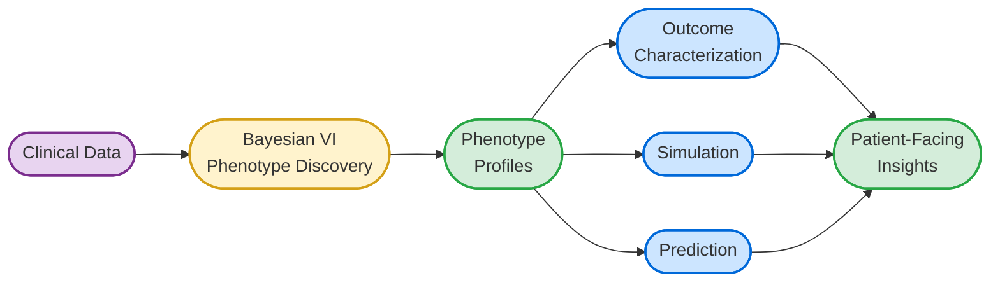
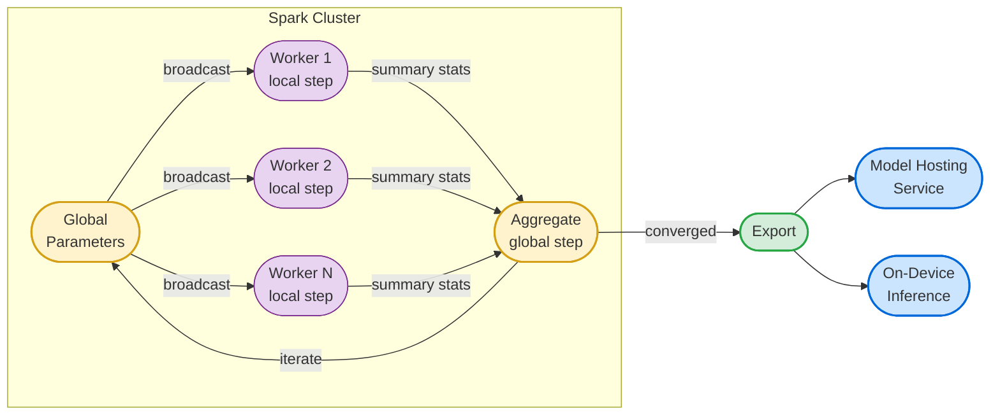

# Bayesian State Modeling for Clinical Phenotype Discovery and Patient Outcomes

This project develops a distributed [Bayesian variational-inference](https://en.wikipedia.org/wiki/Variational_Bayesian_methods) (VI) state modeling framework for unsupervised clinical phenotype discovery and outcome characterization, with the goal of **enabling personalized, patient-facing health insights, including outcome prediction and simulation conditioned
on population-derived statistical patterns.**

The work spans three layers: a research design for the clinical modeling approach, a reusable software framework for fitting Bayesian models at scale on Spark, and a milestone plan for delivering these capabilities within the CHARMTwinsight platform.

---

## How It Works

Following well-established modeling techniques, clinical records are organized into 
'documents', where each document is a collection of diagnosis, drug, procedure, etc. 
codes. What constitutes a "document" is flexible: a single visit, a
patient's complete history, or records grouped by time window, depending on the
clinical question. We'll implement a modern Bayesian nonparametric model, the Hierarchical
Dirichlet Process (HDP), to discover **clinical phenotypes**: recurring patterns
of diagnoses that tend to appear together. The model decides *how many* phenotypes
exist rather than requiring that number as input, and each phenotype is a full
distribution over the diagnosis vocabulary rather than a hard cluster assignment.

Because the approach is Bayesian, the model quantifies uncertainty at every level:
which diagnoses characterize which phenotype, how strongly a given document
reflects each phenotype, and how confident those estimates are given the available
data. The per-document phenotype profiles then serve as rich, interpretable
features for downstream outcome characterization, simulation, and prediction
tasks.

The key difference from Latent Dirichlet Allocation (LDA, a common choice for clinical modeling
that we have previously applied on large-scale data) is that the HDP places a Dirichlet Process prior over the phenotype space via the base distribution G₀, so the number of phenotypes
is automatically discovered and grows with the data. As a generative process, each document (patient, visit, etc.) draws its own mixture weights θ from G₀, and each observed clinical event is generated by first selecting a phenotype (z) then drawing from that phenotype's distribution (β).

The HDP is fit using **variational inference**, an optimization-based approach
to Bayesian estimation that scales to large datasets. The algorithm iterates
between local and global updates, minimizing the KL divergence between an
approximate posterior *q* and the true posterior:

$$\mathcal{L}(q) = \mathbb{E}_q[\log p(\mathbf{w}, \boldsymbol{\theta}, \boldsymbol{\beta})] - \mathbb{E}_q[\log q(\boldsymbol{\theta}, \boldsymbol{\beta})]$$

where **w** are the observed diagnosis codes, **θ** are per-document phenotype
mixture weights, and **β** are the phenotype distributions. In practice each
iteration:

1. **Local step**: for each document, update the approximate posterior over its
   phenotype mixture weights, holding the global phenotype definitions fixed.
2. **Global step**: aggregate the local results across all documents to update
   the phenotype distributions themselves (and the number of active phenotypes).

## spark-vi: A Reusable Framework for Distributed Bayesian Modeling

The HDP will be the first model built on **spark-vi**, a new general-purpose PySpark
framework for fitting Bayesian models at scale. The framework is designed to be
reusable: a model author defines the model-specific math, and the framework
handles distribution across a Spark cluster, training loop management,
convergence monitoring, and model export. Other Bayesian models that follow the
same distribute-and-aggregate pattern can plug in without re-implementing the
infrastructure.

Trained models are compact population-level distributional parameters (~30-60 MB) containing no
patient data and minimal-to-no reidentification risk, and small enough to export and deploy to a model hosting service or a patient's device for private, on-device usage.

---

## Documents

- **[Topic-State Modeling Research Design](TOPIC_STATE_MODELING.md)** -- The scientific
  foundation. Describes the Bayesian approach to discovering clinical phenotypes from
  diagnosis code data using a Hierarchical Dirichlet Process, with discussion of
  model architecture, computational design, and extensions for modeling patient
  dynamics.

- **[spark-vi Framework Design](SPARK_VI_FRAMEWORK.md)** -- The software architecture.
  A PySpark-native framework for distributed variational inference where model authors
  implement the math and the framework handles Spark orchestration, training loops,
  diagnostics, and model export. Notebook-first, with compact privacy-friendly model
  artifacts suitable for lightweight deployment including on-device inference.

- **[Milestones (C3.T3b / C3.T4b)](MILESTONES.md)** -- The delivery plan. Eight
  quarterly milestones across two years: Year 3 builds the framework and applies it
  to clinical data; Year 4 integrates trained models with CHARMTwinsight model hosting
  and explores patient-facing outcome capabilities.
