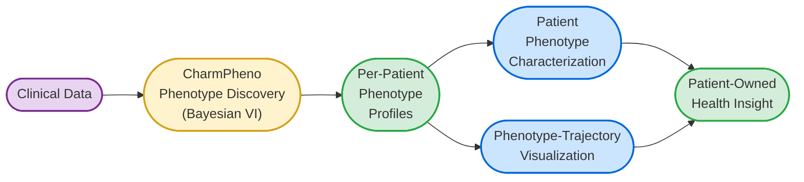
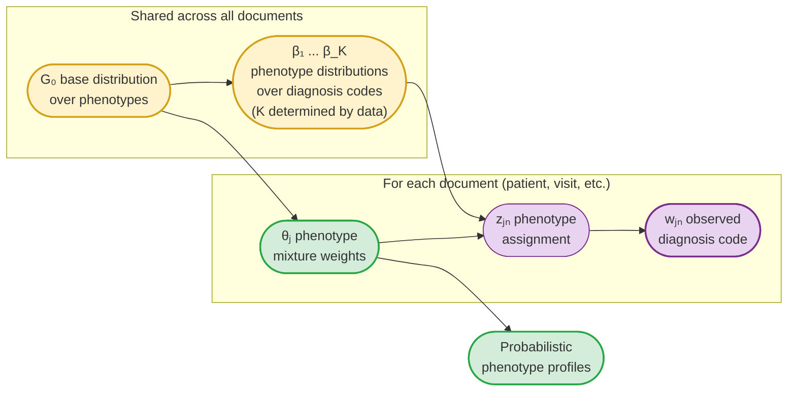
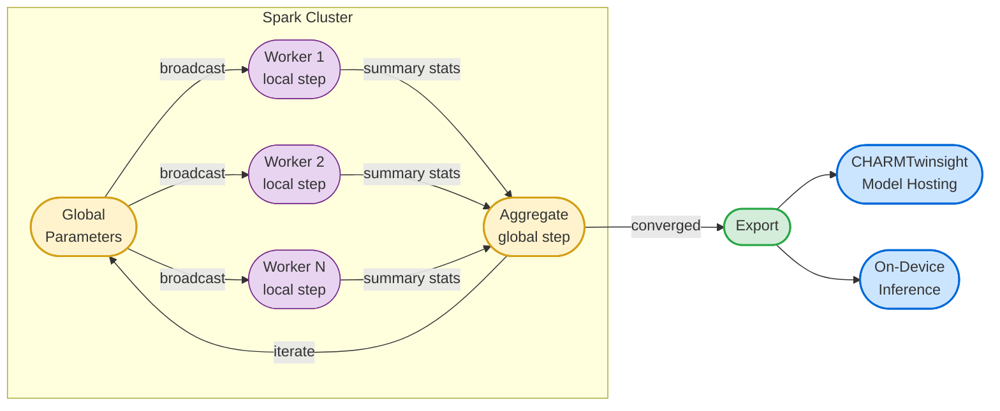

# CharmPheno: Interpretable Computational Phenotyping for Patient-Owned Health Insight

**CharmPheno** is an interpretable **computational phenotyping** capability for discovery and characterization of patient phenotypes from large-scale structured patient health records. The approach uses a Bayesian nonparametric model whose output is interpretable (each phenotype is a clinically-readable distribution over medical codes or events) and uncertainty-aware. The phenotype model is trained on large-scale clinical data via a distributed [Bayesian variational-inference](https://en.wikipedia.org/wiki/Variational_Bayesian_methods) (VI) framework, and then applied per-patient using the trained population-level parameters and that patient's own data. Cohort-based aggregrate phenotypes are also possible for **pediatric, pediatric oncology, and rare-disease populations**, and they may be compared and contrasted to control cohorts as well.

Trained CharmPheno models are delivered through the existing CHARMTwinsight model-hosting service. Because trained models contain only compact population-level parameters and no patient data, on-device inference scenarios, in which the trained model is shipped to a patient device (e.g. via MyCharm) and inference runs locally against the patient's own data, are also a natural deployment target and are investigated as part of the work.

**This work supports:**

- **Patient-controlled longitudinal self-summarization** — a patient's phenotype profile can be maintained and updated over time as new clinical data becomes available, producing a dynamic structured summary of the patient's clinical picture.
- **Phenotype-based patient similarity and trajectory exploration** — phenotype profiles are a substrate for downstream capabilities including patient similarity ("patients like me") and, when combined with dynamic models, generation of plausible patient trajectories for risk exploration and what-if analysis.

The work spans three layers: a research design for the clinical phenotyping approach, a reusable software framework for fitting the underlying Bayesian phenotype models at scale on Spark, and a milestone plan for delivering CharmPheno within the CHARMTwinsight platform.

---

## How It Works

Following well-established modeling techniques, clinical records are organized into 
'documents', where each document is a collection of diagnosis, drug, procedure, etc. 
codes. What constitutes a "document" is flexible: a single visit, a
patient's complete history, or records grouped by time window, depending on the
clinical question. We'll implement a modern Bayesian nonparametric model, the Hierarchical
Dirichlet Process (HDP), to discover **clinical phenotypes**: recurring patterns
of diagnoses that tend to appear together. The model decides *how many* phenotypes
exist rather than requiring that number as input, and each phenotype is a full
distribution over the diagnosis vocabulary rather than a hard cluster assignment.

Because the approach is Bayesian, the model quantifies uncertainty at every level:
which diagnoses characterize which phenotype, how strongly a given document
reflects each phenotype, and how confident those estimates are given the available
data. The per-document phenotype profiles serve as rich, interpretable, uncertainty-aware
summaries of the patient's clinical picture, suitable for direct review by clinicians
and patients alike.

**Interpretable patient phenotype profiles as a first-class output.** The per-patient
phenotype profiles are interpretable, probabilistic representations of patients, where 
each coordinate corresponds to a learned
clinical phenotype with a clinical meaning rather than an opaque latent dimension.
These embeddings are emitted in a form directly consumable by standard vector-search
infrastructure (cosine similarity over the emitted vectors is principled by
construction; see the [research design](TOPIC_STATE_MODELING.md) for details),
enabling patient retrieval, cohort similarity search, and integration with any
downstream ML pipeline that speaks the embedding vocabulary.

Latent Dirichlet Allocation (LDA) is a common choice for clinical modeling
that we have [previously applied on large-scale data](https://www.nature.com/articles/s41746-024-01286-3). While in the same model family, HDP places a Dirichlet Process prior over the phenotype space via the base distribution G₀, so the number of phenotypes
is automatically discovered and grows with the data, and other features such as sparsity better
fit clinical phenotypes as well. As a generative process, each document (patient, visit, etc.) draws its own mixture weights θ from G₀, and each observed clinical event is generated by first selecting a phenotype (z) then drawing from that phenotype's distribution (β).

The HDP is fit using **variational inference**, an optimization-based approach
to Bayesian estimation that scales to large datasets. The algorithm iterates
between local and global updates, minimizing the KL divergence between an
approximate posterior *q* and the true posterior:

$$\mathcal{L}(q) = \mathbb{E}_q[\log p(\mathbf{w}, \boldsymbol{\theta}, \boldsymbol{\beta})] - \mathbb{E}_q[\log q(\boldsymbol{\theta}, \boldsymbol{\beta})]$$

where **w** are the observed diagnosis codes, **θ** are per-document phenotype
mixture weights, and **β** are the phenotype distributions. In practice each
iteration:

1. **Local step**: for each document, update the approximate posterior over its
   phenotype mixture weights, holding the global phenotype definitions fixed.
2. **Global step**: aggregate the local results across all documents to update
   the phenotype distributions themselves (and the number of active phenotypes).

## spark-vi: The Distributed Inference Framework Underneath CharmPheno

The CharmPheno phenotype model is built on **spark-vi**, a general-purpose PySpark
framework for fitting Bayesian models at scale. The framework is designed to be
reusable: a model author defines the model-specific math, and the framework handles
distribution across a Spark cluster, training loop management, convergence monitoring,
and model export. Other Bayesian models that follow the same distribute-and-aggregate pattern
can plug into the same framework without re-implementing the infrastructure.

Trained CharmPheno phenotype models are compact population-level distributional
parameters (~30-60 MB) containing no patient data. They are delivered through the
existing CHARMTwinsight model hosting service, and the compactness of the model
artifacts also makes on-device inference — where the trained model is shipped to a
patient device and inference runs locally against the patient's own data — a natural
deployment target.

---

## Documents

- **[Research Design](TOPIC_STATE_MODELING.md)** -- The scientific foundation. Describes
  the Bayesian approach to discovering clinical phenotypes from diagnosis code data
  using a Hierarchical Dirichlet Process, with discussion of model architecture,
  computational design, and longer-horizon research extensions.

- **[spark-vi Framework Design](SPARK_VI_FRAMEWORK.md)** -- The software architecture.
  A PySpark-native framework for distributed variational inference where model authors
  implement the math and the framework handles Spark orchestration, training loops,
  diagnostics, and model export. Notebook-first, with compact privacy-friendly model
  artifacts suitable for lightweight deployment.

- **[Milestones (C7.T1 / C7.T2)](MILESTONES.md)** -- The delivery plan. Eight quarterly
  milestones across two years: Year 1 designs and implements the CharmPheno phenotype
  discovery framework and applies it to clinical data; Year 2 integrates trained
  CharmPheno models with CHARMTwinsight model hosting and develops per-patient
  phenotype characterization capabilities.
