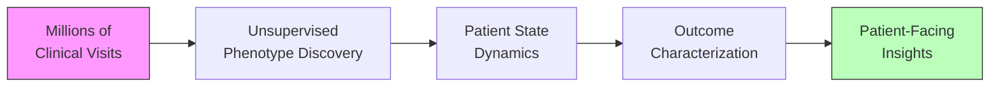
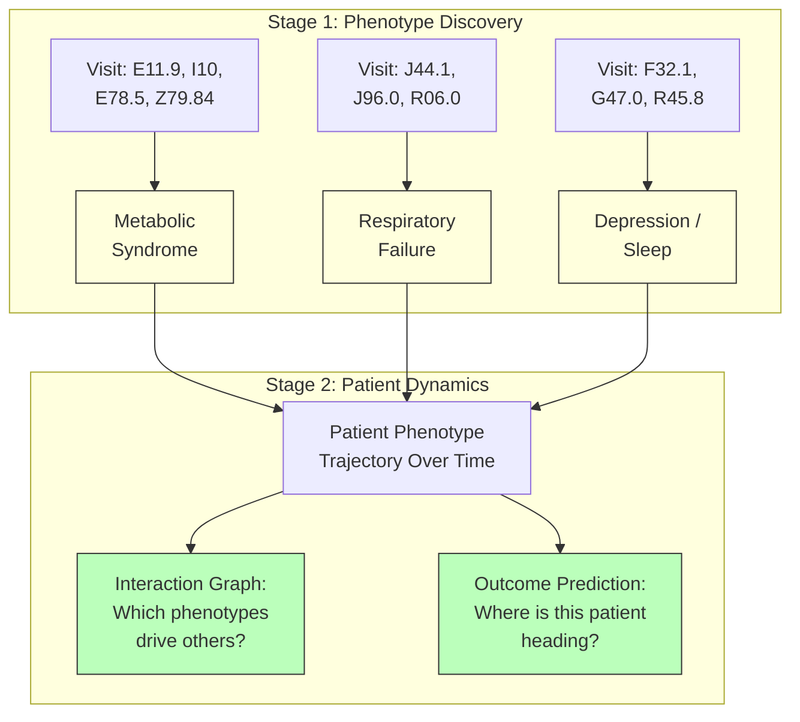
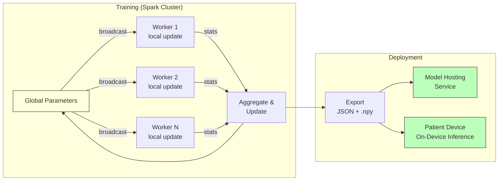

# Bayesian State Modeling for Clinical Phenotype Discovery and Patient Outcomes

This project develops a distributed Bayesian state modeling framework for
unsupervised clinical phenotype discovery and outcome characterization, with the
goal of enabling personalized, patient-facing health insights.

The work spans three layers: a research design for the clinical modeling approach,
a general-purpose software framework for distributed variational inference, and a
milestone plan for delivering these capabilities within the CHARMTwinsight platform.

---

## How It Works

Clinical visits are bags of diagnosis codes. The framework discovers latent
phenotypes — recurring patterns of co-occurring diagnoses — then models how
individual patients move through those phenotypes over time.

## Distributed Training, Compact Models

The framework distributes computation across Spark workers using a
broadcast→update→aggregate pattern. Trained models are compact population-level
parameters (~30-60MB) containing no patient data — small enough to ship to a
patient's phone for private, on-device inference.

---

## Documents

- **[Topic-State Modeling Research Design](TOPIC_STATE_MODELING.md)** — The scientific
  foundation. Describes a two-stage approach: discovering clinical phenotypes from
  diagnosis code data using a Hierarchical Dirichlet Process, then modeling patient
  dynamics through those phenotypes using a sparse Ornstein-Uhlenbeck process.
  Includes background, model architecture, computational design, and references.

- **[spark-vi Framework Design](SPARK_VI_FRAMEWORK.md)** — The software architecture.
  A PySpark-native framework for distributed variational inference where model authors
  implement the math and the framework handles Spark orchestration, training loops,
  diagnostics, and model export. Notebook-first, with compact privacy-friendly model
  artifacts suitable for lightweight deployment including on-device inference.

- **[Milestones (C3.T3b / C3.T4b)](MILESTONES.md)** — The delivery plan. Eight
  quarterly milestones across two years: Year 3 builds the framework and applies it
  to clinical data; Year 4 integrates trained models with CHARMTwinsight model hosting
  and explores patient-facing outcome capabilities.
