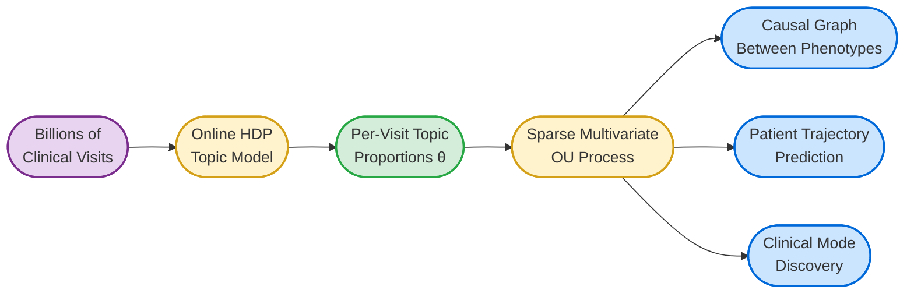
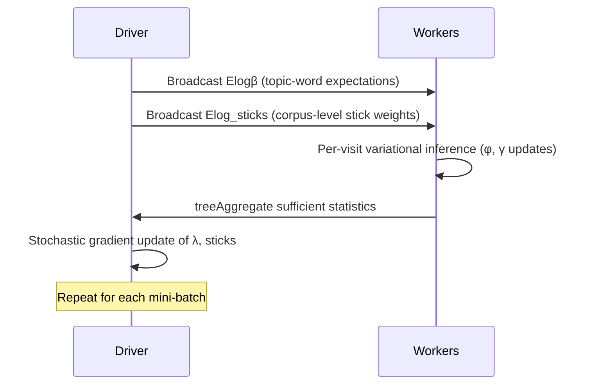
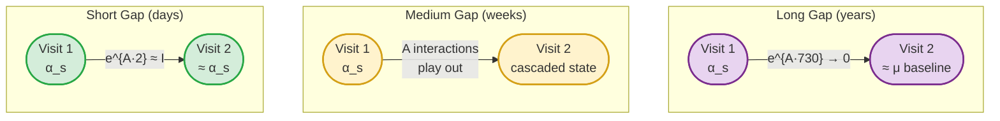
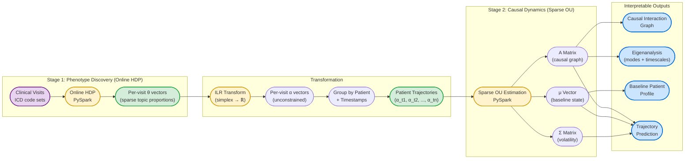
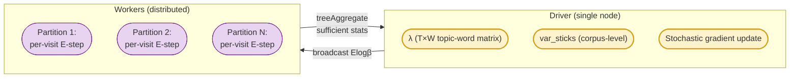
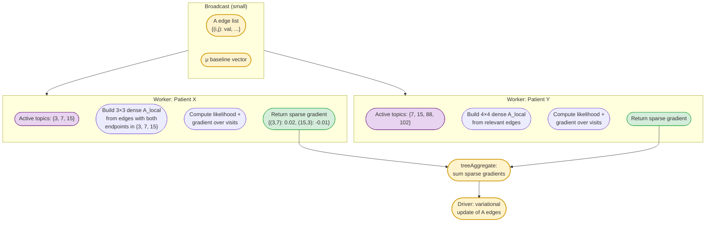
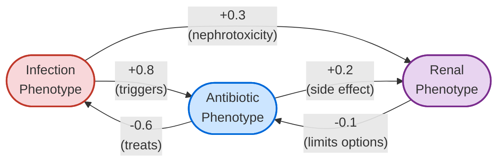

# Topic-State Modeling: Unsupervised Clinical Phenotype Discovery with Continuous-Time Causal Dynamics

## Table of Contents

- [Executive Summary](#executive-summary)
- [Background & Rationale](#background--rationale)
  - [Topic Models for Clinical Data](#topic-models-for-clinical-data)
  - [Why Existing Dynamic Topic Models Don't Fit](#why-existing-dynamic-topic-models-dont-fit)
  - [The Key Insight: Decouple Discovery from Dynamics](#the-key-insight-decouple-discovery-from-dynamics)
  - [Related Work](#related-work)
- [Model Architecture](#model-architecture)
  - [Stage 1: Online HDP for Clinical Phenotype Discovery](#stage-1-online-hdp-for-clinical-phenotype-discovery)
  - [Stage 2: Sparse Multivariate OU for Patient Dynamics](#stage-2-sparse-multivariate-ou-for-patient-dynamics)
  - [How the Stages Connect](#how-the-stages-connect)
- [Computational Design](#computational-design)
  - [HDP: Distributed Variational Inference](#hdp-distributed-variational-inference)
  - [OU: Distributed Sparse Estimation](#ou-distributed-sparse-estimation)
  - [Scaling Analysis](#scaling-analysis)
  - [Technology Stack](#technology-stack)
- [Interpretable Outputs](#interpretable-outputs)
  - [The A Matrix as a Causal Graph](#the-a-matrix-as-a-causal-graph)
  - [Eigenanalysis: Clinical Modes and Timescales](#eigenanalysis-clinical-modes-and-timescales)
  - [Baseline Profile μ](#baseline-profile-μ)
  - [Generative and Predictive Capacity](#generative-and-predictive-capacity)
  - [Patient Embeddings for Retrieval and Downstream ML](#patient-embeddings-for-retrieval-and-downstream-ml)
- [Key Design Decisions & Alternatives Considered](#key-design-decisions--alternatives-considered)
  - [Why HDP over LDA](#why-hdp-over-lda)
  - [Why OU over Discrete Multi-State Models](#why-ou-over-discrete-multi-state-models)
  - [Why Two-Stage over Joint Estimation](#why-two-stage-over-joint-estimation)
  - [Why Wavelet Regression Was Rejected](#why-wavelet-regression-was-rejected)
  - [Why We Moved Past DTM Entirely](#why-we-moved-past-dtm-entirely)
- [Open Questions & Future Work](#open-questions--future-work)
  - [Covariate-Dependent Dynamics](#covariate-dependent-dynamics)
  - [OU Noise Model Absorbing Topic Estimation Uncertainty](#ou-noise-model-absorbing-topic-estimation-uncertainty)
  - [Handling Rare Phenotypes in OU Estimation](#handling-rare-phenotypes-in-ou-estimation)
  - [Periodic and Seasonal Extensions](#periodic-and-seasonal-extensions)
  - [Joint Estimation](#joint-estimation)
  - [Compositional Outcome Association for High-Dimensional Phenotype Profiles](#compositional-outcome-association-for-high-dimensional-phenotype-profiles)
  - [Causal Interpretation Caveats](#causal-interpretation-caveats)
- [References](#references)

---

## Executive Summary

Understanding how patients move through clinical states over time is fundamental to
improving care, predicting outcomes, and identifying causal relationships between
conditions. This document describes a two-stage modeling framework that:

1. **Discovers clinical phenotypes** from diagnosis code data using an Online
   Hierarchical Dirichlet Process (HDP) topic model — without predefining how many
   phenotypes exist or what they look like.
2. **Models patient dynamics** through those phenotypes over continuous time using a
   sparse multivariate Ornstein-Uhlenbeck (OU) process — capturing how clinical
   states evolve, interact, and cause downstream effects.

The framework produces directly interpretable outputs: a set of discovered clinical
phenotypes (clusters of co-occurring diagnoses), a causal interaction graph between
phenotypes, characteristic timescales of recovery and progression, and per-patient
predictive trajectories.

The entire pipeline runs in **pure PySpark with NumPy/SciPy** — no Scala, no custom
JVM code, no special cluster permissions. Both stages use Spark's distributed
computation effectively, scaling to billions of clinical visits and hundreds of
discovered phenotypes.



**Key properties:**

- **No predefined phenotypes.** The HDP discovers how many clinical phenotypes exist
  and what they contain, directly from co-occurrence patterns in diagnosis codes.
- **Continuous time.** Irregular visit spacing is handled natively — no need to bin
  time into arbitrary windows.
- **Causal structure.** The learned interaction matrix reveals which phenotypes drive
  or inhibit other phenotypes, with explicit timescales.
- **Generative and predictive.** The model can simulate future patient trajectories
  and provide probabilistic forecasts at any time horizon.
- **Scalable.** Both stages distribute computation across Spark workers. The natural
  sparsity of clinical data (few active phenotypes per patient) keeps per-patient
  computation small even with hundreds of global phenotypes.
- **Interpretable patient embeddings.** The pipeline produces dense, low-dimensional
  per-patient vectors whose coordinates are learned clinical phenotypes (not opaque
  latent dimensions), in a form directly consumable by standard vector-search
  infrastructure via cosine similarity. Both a static per-patient embedding (from
  Stage 1) and a continuous-time-indexed dynamic embedding trajectory (from Stage 2)
  are available. See [Patient Embeddings for Retrieval and Downstream ML](#patient-embeddings-for-retrieval-and-downstream-ml).

---

## Background & Rationale

### Topic Models for Clinical Data

Topic models discover latent structure in collections of discrete data. Originally
developed for text (where "topics" are clusters of co-occurring words), they apply
naturally to clinical visit data:

| Text Domain | Clinical Domain |
|---|---|
| Document | Clinical visit (ED encounter, inpatient stay, office visit) |
| Word | Diagnosis code (ICD-10) |
| Topic | Clinical phenotype (a pattern of co-occurring diagnoses) |
| Topic proportion | How much each phenotype characterizes a given visit |

A visit with codes `{E11.9, I10, E78.5, Z79.84}` (type 2 diabetes, hypertension,
hyperlipidemia, long-term insulin use) would load heavily on a "metabolic syndrome
management" phenotype. The model discovers these phenotypes unsupervised from
co-occurrence patterns across millions of visits.

**Why visits are the right document unit.** A clinical visit is a natural,
semantically coherent bundle of diagnoses — it captures what is going on with a
patient at a point in time. Alternative slicing strategies (per-day, per-week,
per-patient) either produce documents too sparse to infer topics from, or collapse
temporal structure that we want to preserve for the dynamics stage.

### Why Existing Dynamic Topic Models Don't Fit

The Dynamic Topic Model (DTM; Blei & Lafferty, 2006) extends LDA by chaining topics
through a state space model over time:

$$\beta_{t,k} \mid \beta_{t-1,k} \sim \mathcal{N}(\beta_{t-1,k},\; \sigma^2 I)$$

where $\beta_{t,k}$ is the natural parameter of the word distribution for topic $k$
at time slice $t$. This is elegant but problematic for clinical data:

1. **Fixed number of topics.** DTM requires specifying $K$ in advance. For
   exploratory analysis of clinical phenotypes, we don't know how many exist — and
   the answer varies by patient population. The Hierarchical Dirichlet Process (HDP)
   discovers $K$ from the data.

2. **Discrete, non-overlapping time slices.** DTM bins documents by time period.
   Clinical visits occur at irregular, patient-specific times.

3. **Independent topic evolution.** Each topic evolves as an independent random walk.
   There is no mechanism for one topic to influence another — but in clinical data,
   topic interactions are the primary phenomenon of interest (infection leads to
   organ damage, treatment suppresses symptoms).

4. **Wavelet regression discards multi-scale signal.** DTM's wavelet-based
   variational inference uses thresholding to separate signal from noise, zeroing out
   small wavelet coefficients. In clinical data, meaningful dynamics span all
   timescales — from acute events (days) to seasonal patterns (months) to chronic
   progression (years). Thresholding would discard real signal.

### The Key Insight: Decouple Discovery from Dynamics

Rather than building a single monolithic model, we separate concerns:

- **Stage 1 (HDP):** Discover *what the clinical phenotypes are* — a static,
  atemporal problem. What patterns of diagnoses co-occur?
- **Stage 2 (OU):** Model *how patients move through phenotypes over time* — a
  continuous-time dynamics problem. How do phenotype states evolve and interact?

This separation is both practical and principled:

- **Each stage uses the best tool for its subproblem.** HDP for nonparametric
  discrete mixture modeling; OU for continuous-time multivariate dynamics.
- **Each stage is independently interpretable and debuggable.** You can inspect and
  validate the discovered phenotypes before modeling their dynamics.
- **The stages communicate through a clean interface:** per-visit topic proportion
  vectors $\theta_d$.

### Related Work

The components of this framework each have precedent, but the combination —
nonparametric topic discovery on diagnosis codes with sparse continuous-time dynamics
on individual patient trajectories — addresses a gap in the existing literature.

**Topic models for clinical data.** LDA has been applied directly to diagnosis codes
to discover disease groupings (Li et al., 2014), and to ICU clinical notes to extract
latent features predictive of mortality (Ghassemi et al., 2014). UPhenome (Pivovarov
et al., 2015) extended this to jointly model heterogeneous EHR data types (notes,
medications, labs, codes) under shared phenotypes. MixEHR (Li et al., 2020) further
refined multi-view clinical topic modeling with data-type-specific distributions.
These approaches demonstrate that topic models can discover clinically meaningful
phenotypes from EHR data, but all use a fixed number of topics and operate without
temporal dynamics.

**Nonparametric clinical topic models.** HDP-family models have been applied to
diagnosis codes (e.g., the word-distance-dependent CRF of Chen et al., 2016), removing
the need to pre-specify the number of phenotypes. However, these remain static models
with no temporal component.

**Temporal topic models in clinical settings.** The Dynamic Topic Model (Blei &
Lafferty, 2006) captures corpus-level topic drift over time, and has been compared
with other temporal approaches (NMF, BERTopic) on clinical notes (Meaney et al.,
2022). However, these model how *topics themselves* change over time at the population
level — not how individual patients move through a fixed set of topics. This is a
fundamental distinction: corpus-level topic evolution is about changing medical
language or practice patterns, while patient-level dynamics are about disease
progression and treatment response.

**Individual clinical trajectory modeling.** Schulam & Saria (2015) model
individualized disease trajectories using hierarchical Gaussian processes on
continuous biomarkers (e.g., lung function in scleroderma). Ranganath et al. (2016)
use deep generative models aligned by failure time for survival analysis. These
approaches model individual dynamics but on continuous measurements, not on discrete
diagnosis-code-derived topic proportions.

**OU processes in clinical/biomedical settings.** Tran et al. (2021) use latent OU
models for longitudinal categorical clinical data (ALS progression), demonstrating
that OU dynamics can capture oscillatory patterns via complex eigenvalues. Hughes et
al. (2017) combine OU processes with random effects for serial biomarker correlation
(CD4 counts in HIV). Gaiffas & Matulewicz (2019) establish the theoretical
foundations for $L_1$-penalized estimation of high-dimensional OU drift matrices — the
direct methodological basis for the sparse estimation in our Stage 2.

**Distributed variational inference frameworks.** The AMIDST toolbox (Masegosa et al.,
2019) is the closest prior art for a general-purpose distributed VI framework. Built
in Java with Apache Flink/Spark backends, AMIDST implements Variational Message Passing
for conjugate exponential family models (GMMs, HMMs, Kalman filters, factor analysis,
LDA) and demonstrated billion-parameter inference on 16-node clusters. However, AMIDST
has been unmaintained since 2018, supports only ~6 hardcoded distribution types (no
user-defined exponential families), and lacks nonparametric models (HDP, Dirichlet
processes) — its LDA requires fixed K. Its creator (Masegosa) has since moved to
learning theory and variational structure learning (Masegosa & Gómez-Olmedo, 2025).
A successor project, InferPy (Python/TensorFlow Probability), is also dormant.
In the single-machine space, Akbayrak et al. (2022) embed stochastic VI and
Conjugate-Computation VI into ForneyLab, a Julia message-passing framework — extending
automated inference beyond deterministic VMP but without distributed computation.
General-purpose probabilistic programming frameworks (Pyro, NumPyro, TFP) support SVI
but target GPU-centric workflows rather than Spark-cluster-over-partitioned-data
settings. No active project provides a reusable distributed VI framework on Spark for
arbitrary models with the broadcast→aggregate→update pattern.

**The gap.** Static clinical topic models discover *what* phenotypes exist but not
*how* patients move through them. Temporal topic models capture population-level topic
drift but not individual trajectories. Individual trajectory models operate on
continuous biomarkers, not on phenotype proportions derived from discrete codes.
Existing distributed VI frameworks either lack nonparametric models and flexible model
definition (AMIDST) or lack distributed computation (ForneyLab, Pyro). Our
framework bridges these by discovering phenotypes nonparametrically (HDP) and then
modeling per-patient phenotype dynamics with sparse continuous-time interactions (OU),
within a reusable distributed framework flexible enough to host both variational
inference and penalized MLE models.

---

## Model Architecture

### Stage 1: Online HDP for Clinical Phenotype Discovery

The Hierarchical Dirichlet Process (Teh et al., 2006) is a nonparametric Bayesian
topic model. Unlike LDA, which requires a fixed number of topics $K$, the HDP uses a
stick-breaking process to let the data determine how many topics are needed.

**Generative process for a visit:**

1. Draw topic proportions $\theta_d$ from a Dirichlet Process
2. For each diagnosis code in the visit:
   - Draw a topic assignment $z_{d,n} \sim \text{Mult}(\theta_d)$
   - Draw a diagnosis code $w_{d,n} \sim \text{Mult}(\phi_{z_{d,n}})$

where $\phi_k$ is the diagnosis distribution for phenotype $k$.

**Online variational inference** (Wang, Paisley & Blei, 2011) processes the corpus
in mini-batches, making it suitable for very large datasets. Each iteration:



**Key parameters:**

| Parameter | Symbol | Role |
|---|---|---|
| Corpus-level truncation | $T$ | Upper bound on number of topics (HDP discovers actual count $\leq T$) |
| Document-level truncation | $K$ | Upper bound on topics per document |
| Topic concentration | $\gamma$ | Controls how many corpus-level topics are used |
| Document concentration | $\alpha$ | Controls how many topics each visit uses |
| Learning rate | $\kappa, \tau$ | Controls stochastic gradient step size: $\rho_t = (t + \tau)^{-\kappa}$ |

**Output:** For each visit $d$, a sparse topic proportion vector
$\theta_d \in \mathbb{R}^T$ where most entries are near zero (a visit with 5-10
diagnosis codes typically loads on 3-8 phenotypes).

### Stage 2: Sparse Multivariate OU for Patient Dynamics

Given the per-visit topic proportions from Stage 1, we model each patient's
trajectory through phenotype space as a continuous-time stochastic process.

**Notation.** The HDP uses a truncation level $T$ (the upper bound on corpus-level
topics). In practice, only $K \leq T$ topics carry meaningful weight. From this point
forward, $K$ refers to the number of active phenotypes retained for the dynamics
stage — typically 100-300 after discarding negligible topics.

**Log-ratio transformation.** Topic proportions $\theta_d$ live on the simplex
(non-negative, sum to 1). We apply the isometric log-ratio (ILR) transform from
compositional data analysis to map them to unconstrained $\mathbb{R}^{K-1}$:

$$\alpha_d = \text{ILR}(\theta_d)$$

**The OU process.** Each patient's transformed state evolves as:

$$d\alpha_t = A(\mu - \alpha_t)\,dt + \Sigma\,dW_t$$

where:

| Symbol | Meaning |
|---|---|
| $\alpha_t \in \mathbb{R}^{K-1}$ | Patient's phenotype state at time $t$ |
| $\mu \in \mathbb{R}^{K-1}$ | Long-run baseline ("healthy equilibrium") |
| $A \in \mathbb{R}^{(K-1) \times (K-1)}$ | Drift matrix — **the causal interaction structure** |
| $\Sigma$ | Diffusion matrix (noise/volatility) |
| $W_t$ | Standard Brownian motion |

The OU process is mean-reverting: deviations from baseline $\mu$ are pulled back at
rates determined by $A$. The off-diagonal entries of $A$ capture how one phenotype's
elevation drives changes in another.

**Closed-form transition density.** The conditional distribution between two
observations at times $s$ and $t$ is Gaussian:

$$\alpha_t \mid \alpha_s \sim \mathcal{N}\!\Big(\mu + e^{A(t-s)}(\alpha_s - \mu),\;\; \Gamma(t-s)\Big)$$

where $\Gamma(\Delta t) = \int_0^{\Delta t} e^{Au}\,\Sigma\Sigma^\top\, e^{A^\top u}\,du$.

This means:
- **Short time gap ($\Delta t$ small):** $e^{A \Delta t} \approx I + A\Delta t$ —
  the state barely moves. Prediction is close to $\alpha_s$.
- **Long time gap ($\Delta t$ large):** $e^{A \Delta t} \to 0$ — the state has
  reverted toward $\mu$. Prediction is close to baseline.
- **Medium gap:** The interactions in $A$ play out — cascading effects between
  phenotypes unfold according to the learned dynamics.

The variance $\Gamma(\Delta t)$ also grows with the gap, correctly reflecting
increased uncertainty for patients not seen recently.



### How the Stages Connect



---

## Computational Design

### HDP: Distributed Variational Inference

The Online HDP follows Spark MLlib's OnlineLDA distribution pattern — the same
architecture that Spark uses for its built-in LDA implementation.

**What runs where:**



**Per-iteration data flow:**

1. **Broadcast** ($O(T \times V)$): Driver sends current topic-word expectations
   $E[\log \beta]$ to all workers.
2. **mapPartitions** ($O(\text{docs} \times K \times V_{\text{doc}})$): Each worker
   runs variational inference for its visits. For each visit, iterate between:
   - $\phi$ updates (document-level topic assignments)
   - $\gamma$ updates (document-level topic proportions)
   - `var_phi` updates (corpus-level topic assignments)
3. **treeAggregate** ($O(T \times V)$, tree depth 2): Workers sum sufficient
   statistics and send the aggregated result to the driver.
4. **Driver M-step**: Stochastic natural gradient update of $\lambda$ and
   corpus-level sticks.

**Why not collect to driver (as the original Scala implementation does):**
The original intel-spark OnlineHDP implementation calls `chunk.collect()` to pull all
documents to the driver, then runs inference locally — wasting the cluster entirely.
Our port keeps the expensive per-document computation on workers, following the same
pattern that Spark MLlib's own `OnlineLDAOptimizer` uses: broadcast model, distributed
E-step, tree-aggregated statistics.

**Implementation requirement: standalone inference entry point.** The per-document
E-step (step 2 above) must be exposed as a first-class callable of the form
`infer(documents_rdd, frozen_globals) -> per_doc_posteriors_rdd`, not just as an
internal step of the training loop. Concretely, given frozen $E[\log \beta]$ and
corpus-level `var_sticks`, it should run the same $\phi$ / $\gamma$ / `var_phi`
coordinate-ascent per document and return the per-document variational posterior
(the $\theta_d$ that Stage 2 consumes), with no treeAggregate and no driver M-step.
This is the standard "apply a trained model to new data" primitive that every online
LDA/HDP implementation exposes (Gensim's `HdpModel.inference()`, Wang's original
`online-hdp`, etc.), and it is required for:

- **Held-out evaluation** during training (per-document perplexity / ELBO on a
  held-out split with frozen globals).
- **The FHIR-compatible inference workflow** targeted by the 48-month deliverable
  ([MILESTONES.md](MILESTONES.md)) — predicting on a new patient at serving time
  *is* frozen-globals inference.
- **Any Stage-1 enhancement that decouples the training document granularity from
  the inference document granularity** (see next paragraph).

This is not extra work — the function already exists inside the training loop; it
just needs a clean name, signature, and a code path that skips the reduce and the
M-step. Getting the API shape right during the initial port is much cheaper than
retrofitting it later, and it falls out naturally from the spark-vi `local_update`
/ `global_update` separation: frozen-globals inference is simply `local_update`
called without a following `global_update`.

**Likely early enhancement: patient-level training, visit-level inference.** Clinical
visits are short documents (5-20 codes), which gives well-identified global
phenotype definitions $\beta_k$ (they see all tokens in the corpus) but noisy
per-visit topic proportions $\theta_d$ (each visit has too few tokens to pin down
its mixture). The MVP uses visit-level documents throughout and lets the OU
observation noise in Stage 2 absorb the per-visit estimation uncertainty — see
[OU Noise Model Absorbing Topic Estimation Uncertainty](#ou-noise-model-absorbing-topic-estimation-uncertainty).
An early enhancement, enabled directly by the standalone inference entry point
above, is to train the HDP with **patient-level documents** (each patient's full
code history concatenated) so that the per-patient variational posteriors are
sharp, then run the frozen-globals inference pass on **visit-level documents** to
produce the per-visit $\theta_d$ that Stage 2 actually needs. Global $\beta_k$
benefits from dramatically longer effective documents, and Stage 2 still receives
visit-resolution inputs. This is not required for the MVP — the visit-level
training path is simpler and the two-stage architecture already tolerates noisy
$\theta_d$ — but it is a probable early win once baseline results are available,
and the API requirement above ensures the port does not foreclose it.

### OU: Distributed Sparse Estimation

The OU estimation exploits two forms of sparsity:

1. **Observation sparsity:** Each patient's visits only involve a small subset of the
   $K$ phenotypes ($\sim$5-20 active topics out of hundreds).
2. **Parameter sparsity:** Most phenotypes don't interact — $A$ is sparse (enforced
   via $L_1$ penalty).

**The $A$ matrix as an edge list.** Rather than storing and transmitting a dense
$K \times K$ matrix, $A$ is represented as a sparse dictionary of nonzero entries:

```
A_edges = {
    (topic_i, topic_j): coefficient,
    ...
}
# ~3,000-5,000 nonzero entries out of K² = 90,000 possible
```

**Per-patient computation uses only the relevant subblock:**



**Per-patient likelihood computation.** For a patient with visits at times
$t_1, t_2, \ldots, t_n$, the log-likelihood contribution is:

$$\ell = \sum_{i=1}^{n-1} \log \mathcal{N}\!\left(\alpha_{t_{i+1}} \;\middle|\; \mu + e^{A_{\text{local}} \cdot \Delta t_i}(\alpha_{t_i} - \mu),\; \Gamma_{\text{local}}(\Delta t_i)\right)$$

where $A_{\text{local}}$ is the small dense subblock for this patient's active
topics, and $\Delta t_i = t_{i+1} - t_i$. The matrix exponential of a $15 \times 15$
matrix is trivial — NumPy computes it in microseconds.

**Estimation via variational Bayes.** We use variational inference with a
sparsity-inducing prior (horseshoe or spike-and-slab) on entries of $A$. This
follows the same distributed pattern as the HDP stage — both stages of the pipeline
use [variational Bayesian methods](https://en.wikipedia.org/wiki/Variational_Bayesian_methods),
giving a coherent framework where uncertainty propagates naturally. The
[spark-vi framework](SPARK_VI_FRAMEWORK.md) generalizes this shared computational
pattern.

For each iteration:

1. **Broadcast** the current variational parameters for $A$, $\mu$, and $\Sigma$
   (small — a few thousand floats).
2. **mapPartitions** over patients: for each patient, extract active topic subset,
   build dense subblock, compute local ELBO contributions and natural gradient
   statistics.
3. **treeAggregate** the sparse gradient dictionaries (sum matching keys).
4. **Driver**: variational update of the global posterior over $A$, $\mu$, $\Sigma$.
   Entries of $A$ whose posterior concentrates near zero are pruned from the edge
   list.

**Why variational Bayes over penalized MLE.** An alternative approach is
$L_1$-penalized maximum likelihood (Gaiffas & Matulewicz, 2019), which produces
point estimates with hard sparsity thresholding. VB is preferable here because:

- **Posterior uncertainty on edges.** Rather than a binary "this edge exists / doesn't
  exist" from $L_1$ thresholding, the posterior gives calibrated confidence: "95%
  credible interval for $A_{ij}$ excludes zero" vs. "wide posterior centered near
  zero." This is more natural for exploratory causal analysis.
- **Smoother sparsity.** Continuous shrinkage priors avoid the numerical instability
  of hard thresholds — edges don't pop in and out discontinuously during
  optimization.
- **Regularization of rare interactions.** With K=300 topics, many topic pairs have
  limited data. The prior regularizes these naturally, producing stable estimates
  where MLE might be erratic.
- **Same computational structure.** The cost per iteration is essentially identical
  to MLE; the variational objective just adds an entropy/KL term computed on the
  driver. Parallelism is unchanged.

### Scaling Analysis

**Stage 1 (HDP) scaling:**

| Dimension | Typical Value | Where It Appears |
|---|---|---|
| $V$ (vocabulary / ICD codes) | 10K-70K | Broadcast size: $T \times V$ |
| $T$ (topic truncation) | 150-300 | Broadcast size, sufficient stats |
| Documents (visits) | $10^6$-$10^9$ | Distributed across workers |
| Words per doc (codes per visit) | 5-20 | Per-doc computation: $O(K \times V_{\text{doc}})$ |

The broadcast of $E[\log \beta]$ at $T=300, V=50\text{K}$ is $\sim$120MB — well
within Spark broadcast limits. With billions of visits, workers stay busy because the
per-document E-step with $K=300$ topics involves substantial matrix computation.

Convergence with short documents (5-20 codes) is not a concern: individual visits
contribute weak per-document signal, but the global topic-word distributions $\lambda$
see aggregated co-occurrence statistics across millions of visits per mini-batch.

**Stage 2 (OU) scaling:**

| Dimension | Typical Value | Where It Appears |
|---|---|---|
| $K$ (active topics) | 100-300 globally | $A$ matrix size: $K \times K$ |
| Active topics per patient | 5-20 | Dense subblock size per patient |
| Patients | $10^5$-$10^7$ | Distributed across workers |
| Visits per patient | 3-50 | Per-patient sequential likelihood |
| Nonzero entries in $A$ | 3K-5K | Edge list broadcast size |

The per-patient computation involves matrix exponentials of $\sim$15$\times$15
matrices — negligible cost. The parallelism is across patients, which is abundant.
The $L_1$ sparsity of $A$ ensures that the broadcast, gradient, and update steps
all operate on $O(\text{nnz}(A))$ rather than $O(K^2)$.

**Nothing large or dense ever moves across the network.** The only dense matrices are
the small per-patient subblocks that are constructed and discarded on individual
workers.

### Technology Stack

| Component | Technology | Notes |
|---|---|---|
| Data distribution | PySpark RDDs | `mapPartitions`, `treeAggregate`, `broadcast` |
| Numerical computation | NumPy, SciPy | `digamma`, `gammaln`, `expm` (matrix exp), linear algebra |
| Log-ratio transform | NumPy (or `compositions` if in R post-hoc) | ILR transform is a matrix multiply |
| Sparse OU optimization | NumPy + custom proximal gradient | L1-penalized MLE with sparse gradient accumulation |
| No additional dependencies | — | No Scala, no JVM jars, no GraphX, no MLlib internals |

---

## Interpretable Outputs

### The $A$ Matrix as a Causal Graph

Each nonzero entry $A_{ij}$ in the drift matrix represents a directed influence:
phenotype $j$ being elevated affects the rate of change of phenotype $i$.



**Interpretation:**
- **Positive $A_{ij}$**: Phenotype $j$ promotes increases in phenotype $i$
- **Negative $A_{ij}$**: Phenotype $j$ suppresses phenotype $i$
- **Diagonal $A_{ii}$**: Self-reversion rate. Large negative = fast
  recovery/resolution. Near zero = chronic/persistent.
- **Zero $A_{ij}$** (absent from edge list): No direct influence (after controlling
  for all other phenotypes)

This is Granger causality in continuous time — $A_{ij} \neq 0$ means phenotype $j$
*predicts* changes in phenotype $i$, conditional on all other phenotypes.

### Eigenanalysis: Clinical Modes and Timescales

The eigenvalues and eigenvectors of $A$ reveal the system's fundamental modes of
dynamics:

**Eigenvalues $\lambda_i$** correspond to timescales:

$$\tau_i = -\frac{1}{\text{Re}(\lambda_i)}$$

gives the characteristic timescale of mode $i$. Fast eigenvalues ($\tau \sim$ days)
correspond to acute dynamics; slow eigenvalues ($\tau \sim$ years) correspond to
chronic progression.

**Eigenvectors** identify which *combinations* of phenotypes move together as a
coordinated unit. A single eigenvector might represent:

| Mode | Phenotypes Involved | Timescale |
|---|---|---|
| Acute decompensation | Heart failure ↑, Fluid overload ↑, Renal ↓ | ~days |
| Treatment response | Infection ↓, Inflammation ↓, Recovery ↑ | ~weeks |
| Chronic progression | Diabetes complications ↑, Vascular disease ↑ | ~years |
| Seasonal respiratory | Flu ↑, Pneumonia ↑, seasonal oscillation | ~months |

Even with 300 phenotypes, the system may have only 5-15 dominant modes — a massive
dimensionality reduction that reveals the fundamental clinical dynamics.

### Baseline Profile $\mu$

The vector $\mu$ represents the long-run equilibrium — what a "stable" patient looks
like in phenotype space. Deviations from $\mu$ are what the OU process models.

With covariate-dependent baselines:

$$\mu(\text{patient}) = \mu_0 + B \cdot [\text{age},\; \text{sex},\; \text{comorbidity index},\; \ldots]$$

different patient populations have different equilibria, and the dynamics in $A$ are
interpreted as "after accounting for demographics."

### Generative and Predictive Capacity

**Prediction.** Given a patient's visit history up to time $t$, the conditional
distribution of their state at any future time $t + \Delta t$ is Gaussian with known
mean and variance — no simulation required for point predictions and confidence
intervals.

$$\hat{\alpha}_{t+\Delta t} = \mu + e^{A \Delta t}(\alpha_t - \mu)$$

$$\text{Var}(\alpha_{t+\Delta t} \mid \alpha_t) = \Gamma(\Delta t)$$

**Generation.** Sampling forward trajectories from any initial state produces
realistic patient futures, enabling:

- Risk stratification ("which patients are likely to drift toward high-acuity
  states?")
- What-if analysis ("if we could suppress the infection phenotype, how does the renal
  trajectory change?")
- Cohort simulation for study design and power analysis

### Patient Embeddings for Retrieval and Downstream ML

The pipeline produces *interpretable* patient embeddings as a first-class output,
not as a rebadging of the topic proportions after the fact. Each layer of the
model contributes an embedding at a different level of abstraction:

- **Phenotype embeddings** ($\beta_k$): each learned phenotype is a sparse vector
  over the diagnosis-code vocabulary, with each coordinate a real clinical code.
  Pairwise similarities between $\beta_k$ rows give a principled measure of
  phenotype relatedness ("which phenotypes share codes").
- **Static patient embeddings** (derived from $\theta_d$): a dense $K$-dimensional
  vector per patient (or per visit, depending on document granularity) where each
  coordinate is the patient's loading on a learned phenotype.
- **Dynamic patient embeddings** (the OU trajectory $\alpha_t$): a time-indexed
  embedding that evolves continuously between visits under the learned dynamics of
  $A$. This is a genuinely unusual output — most clinical embedding approaches
  produce either static representations or discrete per-visit embeddings with no
  between-visit semantics.
- **Clinical-mode embeddings** (eigenvectors of $A$): directions in phenotype space
  corresponding to coordinated dynamic processes, each with its own timescale
  $\tau_i = -1/\text{Re}(\lambda_i)$. These can be used as a further
  dimensionality reduction when similarity in *dynamic mode space* rather than
  phenotype space is the target.

**Principled cosine similarity, by construction.** The natural patient vector
$\theta_d$ lives on the probability simplex $\Delta^{K-1}$, so Euclidean cosine
similarity on raw $\theta_d$ is a widely used *convention* but is not canonical —
it ignores the Fisher-information geometry of probability distributions and
mishandles the zero boundary. The principled fix is to emit a **transformed**
vector from which standard cosine is well-defined, so that downstream
vector-search infrastructure (which universally assumes cosine/Euclidean
geometry) gets correct semantics for free. Two transforms are relevant; both are
$O(K)$ and both fall out of the variational posterior at no additional cost:

- **Hellinger embedding**: $h_d = \sqrt{\theta_d}$ (elementwise square root).
  Because $\sum_k (\sqrt{\theta_{d,k}})^2 = 1$, these vectors live on the
  positive orthant of the unit sphere, and cosine similarity between $h_d$ and
  $h_{d'}$ is exactly the Bhattacharyya coefficient
  $\text{BC}(\theta_d, \theta_{d'}) = \sum_k \sqrt{\theta_{d,k}\theta_{d',k}}$ —
  a well-known principled similarity on probability distributions that respects
  the Fisher metric on the simplex. In practice this means: emit $\sqrt{\theta_d}$
  as the embedding, run vanilla cosine search, and the similarity has a clean
  information-geometric interpretation rather than an ad hoc one.

- **Compositional (ILR) embedding**: $c_d = \text{ILR}(\theta_d)$, the isometric
  log-ratio transform the Stage-2 OU process already uses as its state
  representation. Euclidean (equivalently, cosine after centering) distance on
  $c_d$ is the Aitchison distance on $\theta_d$ — the principled metric from
  compositional data analysis — and is consistent with the geometry the OU
  dynamics live in. Use this embedding when "which patients are nearby in the
  same geometry the dynamics use" is the question.

**Three vectors, three purposes.** The pipeline should emit all three per patient:
raw $\theta_d$ for direct clinical inspection and interpretability (the
phenotype-by-phenotype loadings remain the primary interpretable output);
$\sqrt{\theta_d}$ as the default embedding for general vector-search and retrieval
(Fisher-geometry-principled, cosine-compatible, minimal friction for downstream
tools); and $\text{ILR}(\theta_d)$ as the embedding for dynamics-aware similarity
and any workflow that needs to interoperate with the Stage-2 representation.

**Optional: richer model-aware embeddings.** For use cases where two patients
with similar $\theta_d$ need to be distinguished by *how* their evidence loads on
the model (e.g., one uses the high-probability codes of a phenotype while another
uses tail codes), a Fisher embedding
$U(\theta_d) = \nabla_\theta \log p(\text{patient}_d \mid \theta)$ evaluated at
the trained parameters gives a model-aware patient signature in the full
parameter space. This is a natural byproduct of the E-step — the per-document
gradient contribution is already computed during variational inference — and
generalizes cosine-on-$\theta$ by accounting for all parameters jointly rather
than just the document-level mixing proportions. A PCA or random projection
brings it down to a manageable dimensionality for indexing. This is an
enhancement rather than an MVP deliverable, but the API should be designed so
that exposing it later is a matter of emitting an already-computed quantity.

---

## Key Design Decisions & Alternatives Considered

### Why HDP over LDA

| | LDA | HDP |
|---|---|---|
| Number of topics | Fixed $K$, chosen in advance | Discovered from data |
| Exploratory use | Requires model selection (run multiple $K$, compare) | Single run, automatic |
| Clinical appropriateness | Must guess phenotype count per population | Adapts to data complexity |

For exploratory analysis of clinical phenotypes, not knowing $K$ in advance is the
norm. The HDP's nonparametric nature is a genuine advantage, not just a theoretical
nicety.

### Why OU over Discrete Multi-State Models

Continuous-time multi-state models (e.g., as implemented in the R `msm` package)
require discrete states. Using them with topic model output requires either hard
assignment (losing information) or clustering the continuous topic proportions into a
manageable number of states (introducing an arbitrary discretization).

The OU process works directly with continuous topic proportions:

| | Multi-State Model | OU Process |
|---|---|---|
| State space | Discrete (5-15 states) | Continuous ($\mathbb{R}^{K-1}$) |
| Transition structure | Rate matrix (states → states) | Drift matrix (continuous dynamics) |
| Information loss | Hard assignment or clustering of $\theta$ | None — uses $\theta$ directly |
| Cross-state interactions | Limited to pairwise transition rates | Full matrix $A$ captures all interactions |
| Observation model | Patient "is in" a state | Patient has a continuous phenotype profile |

### Why Two-Stage over Joint Estimation

A joint model that simultaneously discovers topics and models their dynamics would be
theoretically elegant. The Dynamic Topic Model (DTM) is one such approach. We chose
to separate the stages for several reasons:

1. **Simplicity.** Each stage uses well-understood, established methods. The
   variational inference for HDP and the MLE for OU are both well-studied.
2. **Debuggability.** You can inspect and validate the discovered phenotypes before
   modeling their dynamics. A joint model conflates topic quality issues with dynamics
   estimation issues.
3. **Flexibility.** The stages communicate through a clean interface ($\theta$
   vectors). Either stage can be swapped independently — e.g., replace HDP with LDA,
   or replace OU with a VAR model.
4. **Scalability.** Each stage has a clean distributed computation pattern. A joint
   model would require more complex coordination between document-level and
   time-series-level inference.

**What we sacrifice:** A joint model could discover topics that are only
distinguishable by their temporal dynamics. If two phenotypes use similar diagnosis
codes but at different times, the bag-of-words HDP may merge them. In practice, this
is often acceptable if the vocabulary (ICD code set) is rich enough that temporally
distinct phenomena also have distinct code profiles.

### Why Wavelet Regression Was Rejected

The DTM paper (Blei & Lafferty, 2006) offers variational wavelet regression as an
alternative to Kalman filtering for the topic time series. Wavelet regression applies
a wavelet transform to the variational parameters, then **soft-thresholds** the
coefficients — zeroing out small coefficients (interpreted as noise) and keeping large
ones (interpreted as signal).

This is appropriate when high-frequency variation is genuinely noise (e.g.,
year-to-year fluctuations in academic journal content). In clinical data, meaningful
dynamics span all timescales:

- **Days:** Acute infections, post-surgical complications, drug reactions
- **Weeks:** Treatment courses, recovery trajectories, ICU stays
- **Months:** Seasonal respiratory illness, chemotherapy cycles
- **Years:** Chronic disease progression, aging-related comorbidity accumulation

Thresholding would discard real short-timescale clinical signal. The OU process avoids
this entirely — it models dynamics at all timescales simultaneously, with the
eigenvalues of $A$ naturally capturing the full spectrum of characteristic times.

### Why We Moved Past DTM Entirely

Beyond the wavelet issue, DTM has structural limitations for this use case:

1. **No cross-topic dynamics.** DTM evolves each topic independently — there is no
   mechanism for topic A to influence topic B. The paper explicitly states: "For
   simplicity, we do not model the dynamics of topic correlation."
2. **Fixed $K$.** DTM inherits LDA's fixed topic count.
3. **Discrete time.** Documents must be binned into time slices.

Our two-stage approach addresses all three: HDP for flexible $K$, OU for cross-topic
dynamics, and continuous time natively.

---

## Open Questions & Future Work

### Covariate-Dependent Dynamics

The current model assumes a single $A$ matrix and baseline $\mu$ for all patients.
Richer variants could allow:

- **Patient-type-specific baselines:**
  $\mu(\text{patient}) = \mu_0 + B \cdot x_{\text{patient}}$
- **Covariate-dependent dynamics:**
  $A(\text{patient}) = A_0 + \sum_j A_j \cdot x_j$ — e.g., different interaction
  structure for elderly vs. young patients
- **Regime-switching:** $A$ changes based on the patient's current region of
  phenotype space (e.g., different dynamics in acute vs. stable states)

### OU Noise Model Absorbing Topic Estimation Uncertainty

The per-visit topic proportions $\theta_d$ from Stage 1 are *estimates*, not ground
truth. With short documents (5-20 codes), individual $\theta_d$ vectors are noisy.
The OU process's noise term $\Sigma$ naturally absorbs some of this estimation
uncertainty. A more principled approach would propagate the posterior uncertainty from
HDP through to the OU estimation — e.g., by sampling multiple $\theta_d$ draws from
the variational posterior and averaging the OU likelihood, or by incorporating the
variational variance into the OU observation model.

### Handling Rare Phenotypes in OU Estimation

With $L_1$ sparsity on $A$, interactions involving rare phenotypes (few patients, few
visits) will tend to be estimated as zero due to insufficient data. This is
statistically appropriate (don't claim causal relationships you can't support) but
means the model may miss real interactions for uncommon conditions. Hierarchical or
transfer learning approaches could help borrow strength across related phenotypes.

### Tree-Structured HDP for Hierarchical Cohort Pooling

The HDP as planned uses the standard two-level topic-model tree: a global DP $G_0$
over phenotypes and one child DP $G_j$ per patient. The general HDP formulation of
Teh et al. 2006 allows arbitrary-depth trees of DPs, where each interior node draws
from its parent. A natural use case here is a three-level tree

$$
G_0 \;\to\; \{G_g\}_{g \in \text{groups}} \;\to\; \{G_{g,j}\}_{j \in \text{patients in } g}
$$

where "groups" are natural cohort structures: health system, site, disease cohort,
birth-era, or geographic region. **The phenotype atoms remain shared globally**
(every group and patient draws from the same $G_0$), but mixing proportions can
differ by group, giving partial pooling without forcing a single global prior or
fully separate models. This is exactly the setting where HDP's atom-sharing
machinery earns its keep, and it's directly supported in the reference R package
`nicolaroberts/hdp` via custom `ppindex`/`cpindex` tree specifications (used there
for Gibbs sampling; the model is the same).

**Why this is a genuinely novel contribution in the distributed setting.** Online
stochastic VI for HDP as published (Wang, Paisley & Blei 2011, and the Gensim
implementation) assumes the two-level tree. Extending stochastic VI to nested DPs
requires a richer variational family (one stick-breaking factor per interior node)
and per-level update equations that are not available off-the-shelf. There is, to
our knowledge, no published at-scale distributed implementation of a nested online
HDP. Given spark-vi's local/global decomposition, it is a natural vehicle for one.

**Would distributed overhead dominate?** For shallow trees (3 levels), no — the
added cost is small relative to the flat HDP baseline:

- **Broadcast.** Interior-node variational params are $O(\text{num\_groups} \times K)$
  stick-breaking weights — e.g., 1000 groups × 300 topics $\approx$ 2.4MB, negligible
  next to the $\sim$84MB topic-word broadcast that already dominates each iteration.
- **Reduce.** Sufficient statistics still flow leaves → root, but as a tree-shaped
  aggregation. Spark's `treeAggregate` is designed for exactly this pattern; one
  reduce per mini-batch, same as flat HDP.
- **Rounds.** A two-level interior tree does not require intra-mini-batch alternation
  between levels — a single upward message pass suffices per stochastic step, so the
  broadcast/reduce cadence is unchanged.
- **Partitioning.** Co-locating subtrees on executors (partition by group) keeps
  interior-node updates partition-local. Only the global topic-word reduce is
  cross-partition, identical to the flat case.

The real costs are statistical and derivational, not systems-level:

- **Noisy interior-node updates.** Stochastic mini-batches touch only a handful of
  groups per step, so each interior DP receives sparse, noisy sufficient statistics.
  Robbins-Monro convergence still holds, but interior levels will need either larger
  effective batch sizes, per-level learning rates, or variance-reduction tricks.
- **Derivation.** Extending Wang/Paisley/Blei 2011 to the nested case is a real piece
  of VI work — deriving the coordinate updates, bookkeeping for which groups were
  touched in a mini-batch, and a convergence criterion that accounts for sparse
  interior updates. This is a research contribution, not a config flag.
- **Depth caveat.** At 4+ levels, sibling-normalization dependencies can force
  inner iteration within a mini-batch, at which point the advertised "one broadcast,
  one reduce per step" cadence breaks and overhead starts to grow. The three-level
  case avoids this.

**Suggested staging.** Ship the flat two-level HDP first. For most foreseeable
cohort-structure questions, post-hoc analysis of per-patient mixing proportions
grouped by cohort metadata captures the interesting signal at zero additional
modeling cost. Move to an explicit three-level nested HDP only when that post-hoc
analysis shows group-level differences large enough to justify the partial-pooling
machinery — at which point the spark-vi framework is well-positioned to host what
would be a novel distributed implementation.

### Nonlinear Drift and Multi-Attractor Dynamics

The standard OU process has a linear restoring force: the drift $A(\mu - \alpha_t)$
pulls harder when the state is further from baseline. This may be unrealistic for
clinical dynamics — severely ill patients don't necessarily recover faster than mildly
ill ones, progressive conditions may never revert to a healthy baseline, and threshold
effects (e.g., organ failure cascades) can qualitatively change the dynamics at large
displacements. More generally, the single equilibrium $\mu$ cannot represent clinical
populations with multiple stable states (healthy, chronically managed, end-stage).

Replacing the linear drift with a nonlinear function $f(\alpha_t)$ addresses these
concerns while remaining compatible with the spark-vi framework's distributed pattern
(the changes are entirely within `local_update`). Practical options include: **local
linearization** (computing a state-dependent Jacobian $J(\alpha_s)$ at each
observation and reusing the OU transition density with a local drift matrix — an
Extended Kalman Filter approach that preserves closed-form transitions),
**Euler-Maruyama discretization** (subdividing inter-observation intervals into small
steps with approximate Gaussian transitions — more general but requires path
imputation between visits), and **polynomial drift corrections** (e.g., adding a cubic
term $C \cdot (\mu - \alpha)^{\circ 3}$ that weakens the restoring force at large
displacements). Clinically motivated drift forms include saturating forces
($A \cdot \tanh(B(\mu - \alpha))$, where recovery rate plateaus for very sick
patients) and asymmetric drift (different interaction matrices for deterioration vs.
recovery). The linear OU is likely adequate for the primary goal of discovering causal
interaction structure via $A$, but long-horizon prediction and trajectory simulation
would benefit from nonlinear extensions.

**Autoregressive HDP as a complementary trajectory generator.** A different angle on
the same limitation: OU's mean-reversion is a poor prior for chronic or progressive
conditions — a patient who has established a chronic phenotype should become *more*
likely to re-express it, not revert to baseline. HDP's native generative process has
the opposite dynamic (Pólya urn self-reinforcement: tokens attach to existing
phenotypes proportional to how often that phenotype has already appeared), which is
clinically more realistic for persistence but lacks any notion of elapsed time between
visits. An interesting research direction is to make HDP itself continuous-time and
use it as a trajectory generator alongside (or instead of) OU for long-horizon
simulation of chronic conditions. The most tractable route is the
**distance-dependent CRP** (Blei & Frazier 2011) with an exponential temporal kernel:
each token attaches to a prior token with probability proportional to $e^{-\Delta t/\tau}$,
so recent tokens pull harder than old ones, chronic vs. acute emerges from
per-phenotype decay timescales $\tau_k$, and the non-exchangeability (which is the
point) replaces the clock-free CRP with a model where elapsed time genuinely matters.
More ambitious alternatives — marked Hawkes processes with an HDP base measure, or
Dependent Dirichlet Processes $\{G_j(t)\}_{t \geq 0}$ with smooth temporal dependence
(MacEachern 1999; Griffin & Steel 2006) — are more formally principled but have
substantially harder distributed inference. None of this is MVP work: the two-stage
OU pipeline is the primary deliverable. But it is worth investigating in parallel
with the nonlinear-drift extensions above, since the two approaches address the same
realism gap from opposite ends (adding nonlinearity to a reversionary process vs.
adding continuous time to a self-reinforcing one), and comparing them empirically on
chronic-disease cohorts would be informative in its own right.

Any such comparison should be conducted on the common currency of observable codes
rather than on the models' internal representations. Three tests together cover the
relevant ground: **next-visit code prediction** (held-out log-likelihood and
calibration — the cheapest apples-to-apples test), a **chronic-persistence test**
(condition each model on the first appearance of a well-defined chronic phenotype
in a matched cohort, simulate forward, compare persistence curves at 1y/2y/5y
against real outcomes — the test that directly targets OU's mean-reversion
limitation), and an **acute-recovery test** on short-course conditions to guard
against a self-reinforcing model that simply fails to forget. All metrics must be
**stratified by phenotype category** (acute / episodic / chronic-stable /
chronic-progressive), since the whole theoretical argument is that the two model
families should differ on *which phenotypes* they handle well; aggregate numbers
would average away the interesting signal. A small-cohort viability check
(e.g., 10k patients with T2DM, single-machine Gibbs via `nicolaroberts/hdp`) should
precede any distributed implementation work: if dd-CRP-HDP does not clearly beat
OU-linear on the persistence test at that scale, the theoretical argument has not
materialized and the distributed investment is not warranted. Finally, the
comparison should not be framed as winner-take-all — OU carries interventional
semantics via the $A$ matrix that a purely generative autoregressive HDP does not,
so the relevant question is which model should be used for which downstream task
(causal / interventional queries vs. long-horizon trajectory simulation), not which
one replaces the other.

### Periodic and Seasonal Extensions

While the OU process captures timescales through eigenvalues of $A$, it does not
explicitly model periodicity. Extensions could include:

- **Augmented state space** with seasonal components (standard structural time series
  approach — add rotation matrices at known seasonal frequencies)
- **GP kernels** with periodic components for the topic trajectories, at the cost of
  more complex inference
- **Fourier features** in the drift: $A \to A + \sum_f A_f e^{i \omega_f t}$

Whether this complexity is warranted depends on the strength of seasonal signal in
the specific clinical domain.

### Joint Estimation

If the two-stage approach proves limiting (e.g., topics that should be split based on
temporal dynamics are being merged), a joint model could be pursued. The architecture
would combine the HDP variational E-step with an OU-coupled prior over the topic
proportions. This is a substantial research contribution in its own right and should
only be attempted after validating the two-stage pipeline on real data.

### Compositional Outcome Association for High-Dimensional Phenotype Profiles

A natural downstream use of per-patient phenotype profiles is outcome association:
regressing a clinical outcome against the phenotype profile plus covariates. The
standard approach in prior work — including the PI's Long-COVID topic-modeling
paper (O'Neil et al., 2024, *npj Digital Medicine*) and Hubbard et al. (2021) — is
to run per-phenotype univariate regressions, one model per topic. This is
interpretable and tractable, but it ignores the compositional constraint
($\sum_k \theta_k = 1$): the $K$ regressions are not independent, and effect-size
and significance estimates are miscalibrated in known ways.

The statistically principled alternative is a **compositional regression** that
treats $\theta$ as a unit — Dirichlet regression, multinomial-logit regression, or
log-ratio regression on an ILR-transformed profile. At the scale of $K \sim 300$
topics this is computationally heavy and interpretability-poor (coefficients live
in a log-ratio basis, not in the original phenotype space), which is why the
per-phenotype approach has been the practical default. Three candidate
mitigations are worth investigating if downstream outcome association becomes a
deliverable:

- **Sparse log-contrast regression** (Lin et al.) with $L_1$ or grouped penalties,
  which selects a handful of relevant phenotypes automatically and effectively
  reduces the compositional dimensionality to the support set.
- **Projection to a lower-dimensional compositional subspace** — either clinically
  motivated meta-phenotype groupings, hierarchical clustering of topics, or
  Aitchison-geometry PCA — followed by compositional regression in the
  reduced space.
- **Per-phenotype regression with explicit compositional acknowledgment**:
  multiplicity correction, framing effect sizes as relative rather than absolute,
  and reporting the compositional constraint as a known limitation. This is the
  most defensible version of current practice and probably the right baseline to
  compare any more sophisticated approach against.

None of this is in scope for the core phenotyping deliverable. But it is the
question a statistically-sophisticated reviewer will ask about CharmPheno's
downstream usability, and it is the natural methodological follow-on once the
phenotyping capability is in place.

### Causal Interpretation Caveats

The $A$ matrix captures Granger causality — predictive relationships conditional on
the observed phenotypes. This is not the same as interventional causality. Unmeasured
confounders (e.g., a medication that affects two phenotypes simultaneously but is not
in the diagnosis code vocabulary) can create spurious entries in $A$. Enriching the
"vocabulary" with procedure codes, medications, and lab results would mitigate this,
at the cost of a larger and more heterogeneous feature space for the HDP.

---

## References

### Topic Models

- **LDA.** Blei, D. M., Ng, A. Y., & Jordan, M. I. (2003). Latent Dirichlet
  Allocation. *Journal of Machine Learning Research*, 3, 993-1022.
  [paper](https://www.jmlr.org/papers/volume3/blei03a/blei03a.pdf)

- **HDP.** Teh, Y. W., Jordan, M. I., Beal, M. J., & Blei, D. M. (2006).
  Hierarchical Dirichlet Processes. *Journal of the American Statistical
  Association*, 101(476), 1566-1581.
  [doi](https://doi.org/10.1198/016214506000000302)

- **Online LDA.** Hoffman, M. D., Blei, D. M., & Bach, F. (2010). Online Learning
  for Latent Dirichlet Allocation. *Advances in Neural Information Processing
  Systems* 23 (NeurIPS). NeurIPS Test of Time Award, 2021.
  [paper](https://proceedings.neurips.cc/paper/2010/hash/71f6278d140af599e06ad9bf1ba03cb0-Abstract.html)

- **Online HDP.** Wang, C., Paisley, J., & Blei, D. M. (2011). Online Variational
  Inference for the Hierarchical Dirichlet Process. *Proceedings of the 14th
  International Conference on Artificial Intelligence and Statistics (AISTATS)*,
  PMLR 15:752-760.
  [paper](https://proceedings.mlr.press/v15/wang11a.html)

- **DTM.** Blei, D. M. & Lafferty, J. D. (2006). Dynamic Topic Models. *Proceedings
  of the 23rd International Conference on Machine Learning (ICML)*, 113-120.
  [doi](https://doi.org/10.1145/1143844.1143859)

### Topic Models for Clinical Data

- **MixEHR.** Li, Y., Nair, P., Lu, X. H., Wen, Z., Wang, Y., et al. (2020).
  Inferring Multimodal Latent Topics from Electronic Health Records. *Nature
  Communications*, 11, 2536.
  [doi](https://doi.org/10.1038/s41467-020-16378-3)

- **UPhenome.** Pivovarov, R., Perotte, A. J., Grave, E., Angiolillo, J., Wiggins,
  C. H., & Elhadad, N. (2015). Learning Probabilistic Phenotypes from Heterogeneous
  EHR Data. *Journal of Biomedical Informatics*, 58, 156-165.
  [doi](https://doi.org/10.1016/j.jbi.2015.10.001)

- **LDA for ICU mortality.** Ghassemi, M., Naumann, T., Doshi-Velez, F., Brimmer,
  N., Joshi, R., Rumshisky, A., & Szolovits, P. (2014). Unfolding Physiological
  State: Mortality Modelling in Intensive Care Units. *KDD 2014*.
  [doi](https://doi.org/10.1145/2623330.2623742)

- **LDA on diagnosis codes.** Li, D. C., Thermeau, T., Chute, C., & Liu, H. (2014).
  Discovering Associations Among Diagnosis Groups Using Topic Modeling. *AMIA Joint
  Summits on Translational Science Proceedings*, 2014, 43-49.
  [PMC](https://pmc.ncbi.nlm.nih.gov/articles/PMC4419765/)

- **Anchor-based phenotyping.** Halpern, Y., Horng, S., Choi, Y., & Sontag, D.
  (2016). Electronic Medical Record Phenotyping Using the Anchor and Learn Framework.
  *JAMIA*, 23(4), 731-740.
  [doi](https://doi.org/10.1093/jamia/ocw011)

- **Temporal topic comparison.** Meaney, C., Escobar, M., Stukel, T. A., Austin,
  P. C., & Jaakkimainen, L. (2022). Comparison of Methods for Estimating Temporal
  Topic Models From Primary Care Clinical Text Data. *JMIR Medical Informatics*.
  [doi](https://doi.org/10.2196/40102)

### Individual Clinical Trajectory Modeling

- **Individualized trajectories.** Schulam, P. & Saria, S. (2015). A Framework for
  Individualizing Predictions of Disease Trajectories by Exploiting Multi-Resolution
  Structure. *NeurIPS 2015*.
  [paper](https://proceedings.neurips.cc/paper/2015/hash/285e19f20beded7d215102b49d5c09a0-Abstract.html)

- **Deep survival analysis.** Ranganath, R., Perotte, A., Elhadad, N., & Blei, D.
  (2016). Deep Survival Analysis. *MLHC 2016*.
  [arXiv](https://arxiv.org/abs/1608.02158)

### Continuous-Time Dynamics and Causality

- **Multivariate OU estimation.** Fasen, V. (2013). Statistical Estimation of
  Multivariate Ornstein-Uhlenbeck Processes and Applications to Co-integration.
  *Journal of Econometrics*, 172(2), 325-337.
  [doi](https://doi.org/10.1016/j.jeconom.2012.08.019)

- **Bayesian OU inference.** Singh, R., Ghosh, D., & Adhikari, R. (2018). Fast
  Bayesian Inference of the Multivariate Ornstein-Uhlenbeck Process. *Physical
  Review E*, 98, 012136.
  [arXiv](https://arxiv.org/abs/1706.04961)

- **Latent OU for clinical data.** Tran, T. D., Lesaffre, E., Verbeke, G., &
  Duyck, J. (2021). Latent Ornstein-Uhlenbeck Models for Bayesian Analysis of
  Multivariate Longitudinal Categorical Responses. *Biometrics*, 77(3), 689-701.
  [doi](https://doi.org/10.1111/biom.13292)

- **Sparse high-dimensional OU.** Gaiffas, S. & Matulewicz, G. (2019). Sparse
  Inference of the Drift of a High-Dimensional Ornstein-Uhlenbeck Process. *Journal
  of Multivariate Analysis*, 169, 1-20.
  [arXiv](https://arxiv.org/abs/1707.03010)

- **Continuous-time Granger causality.** Wahl, B., Feudel, U., Hlinka, J., Wachter,
  M., Peinke, J., & Freund, J. A. (2016). Granger-Causality Maps of Diffusion
  Processes. *Physical Review E*, 93, 022213.
  [doi](https://doi.org/10.1103/PhysRevE.93.022213)

### Sparse High-Dimensional Time Series

- **Sparse VAR.** Basu, S. & Michailidis, G. (2015). Regularized Estimation in
  Sparse High-Dimensional Time Series Models. *Annals of Statistics*, 43(4),
  1535-1567.
  [doi](https://doi.org/10.1214/15-AOS1315)

- **Network Granger causality.** Basu, S., Shojaie, A., & Michailidis, G. (2015).
  Network Granger Causality with Inherent Grouping Structure. *Journal of Machine
  Learning Research*, 16(13), 417-453.
  [paper](https://jmlr.org/papers/v16/basu15a.html)

### Bayesian Sparsity Priors

- **Horseshoe prior.** Carvalho, C. M., Polson, N. G., & Scott, J. G. (2010). The
  Horseshoe Estimator for Sparse Signals. *Biometrika*, 97(2), 465-480.
  [doi](https://doi.org/10.1093/biomet/asq017)

- **Regularized horseshoe.** Piironen, J. & Vehtari, A. (2017). Sparsity
  Information and Regularization in the Horseshoe and Other Shrinkage Priors.
  *Electronic Journal of Statistics*, 11(2), 5018-5051.
  [doi](https://doi.org/10.1214/17-EJS1337SI)

### Distributed Variational Inference Frameworks

- **AMIDST.** Masegosa, A. R., Martinez, A. M., Ramos-López, D., Langseth, H.,
  Nielsen, T. D., & Salmerón, A. (2019). AMIDST: A Java Toolbox for Scalable
  Probabilistic Machine Learning. *Knowledge-Based Systems*, 163, 595-597.
  [doi](https://doi.org/10.1016/j.knosys.2018.09.030)

- **Distributed VI on clusters.** Masegosa, A. R., Martinez, A. M., Langseth, H.,
  Nielsen, T. D., Salmerón, A., Ramos-López, D., & Madsen, A. L. (2017). Scaling up
  Bayesian Variational Inference Using Distributed Computing Clusters. *International
  Journal of Approximate Reasoning*, 88, 91-108.
  [doi](https://doi.org/10.1016/j.ijar.2017.05.010)

- **Stochastic VMP in ForneyLab.** Akbayrak, S., Şenöz, İ., Sarı, A., & de Vries, B.
  (2022). Probabilistic Programming with Stochastic Variational Message Passing.
  *International Journal of Approximate Reasoning*, 148, 235-252.
  [doi](https://doi.org/10.1016/j.ijar.2022.06.006)

- **Variational structure learning.** Masegosa, A. R. & Gómez-Olmedo, M. (2025).
  Toward Variational Structural Learning of Bayesian Networks. *IEEE Access*, 13,
  26130-26141.
  [doi](https://doi.org/10.1109/ACCESS.2025.3540671)

### Compositional Data Analysis

- **ILR transform.** Egozcue, J. J., Pawlowsky-Glahn, V., Mateu-Figueras, G., &
  Barcelo-Vidal, C. (2003). Isometric Logratio Transformations for Compositional
  Data Analysis. *Mathematical Geology*, 35(3), 279-300.
  [doi](https://doi.org/10.1023/A:1023818214614)
