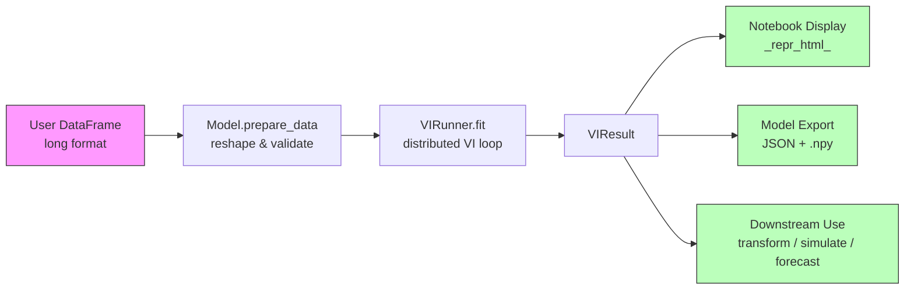
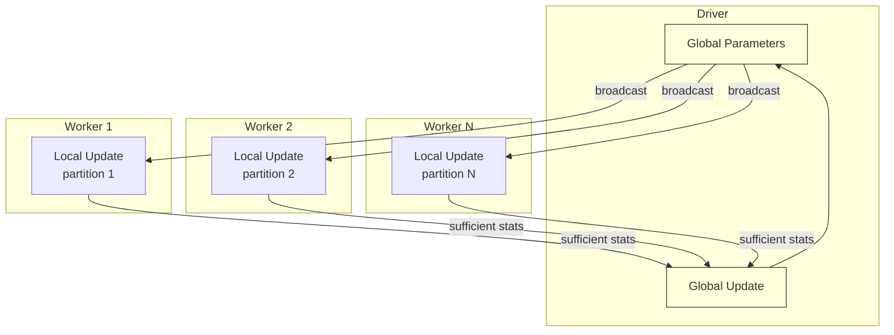
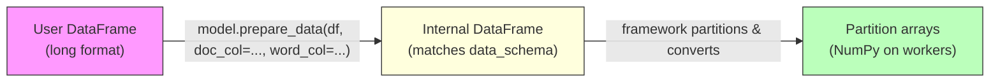

# spark-vi: A PySpark Framework for Distributed Variational Inference

## Table of Contents

- [Executive Summary](#executive-summary)
- [Background & Motivation](#background--motivation)
  - [The Distributed VI Pattern](#the-distributed-vi-pattern)
  - [Why a Framework](#why-a-framework)
  - [Design Philosophy](#design-philosophy)
- [Framework Architecture](#framework-architecture)
  - [Core Computational Pattern](#core-computational-pattern)
  - [The VIModel Base Class](#the-vimodel-base-class)
  - [Data Contract: User-Facing vs. Internal](#data-contract-user-facing-vs-internal)
  - [The VIRunner](#the-virunner)
  - [VIConfig](#viconfig)
  - [VIResult and Model Export](#viresult-and-model-export)
- [Notebook Diagnostics and Output](#notebook-diagnostics-and-output)
  - [Live Training Display](#live-training-display)
  - [Batch Mode](#batch-mode)
  - [Model-Level Display](#model-level-display)
- [Pre-Built Models](#pre-built-models)
  - [Online HDP (Topic Model)](#online-hdp-topic-model)
  - [Sparse OU Estimator (Continuous-Time Dynamics)](#sparse-ou-estimator-continuous-time-dynamics)
  - [Third Model (TBD)](#third-model-tbd)
- [Project Structure](#project-structure)
- [Tooling and Development](#tooling-and-development)
- [Design Decisions](#design-decisions)
- [Future Directions](#future-directions)
- [References](#references)

---

## Executive Summary

**spark-vi** is a PySpark-native framework for distributed variational inference on
large datasets. Model authors subclass a simple base class and implement the
model-specific math — local variational updates, sufficient statistics, and global
parameter updates. The framework handles all Spark orchestration, training loop
management, convergence diagnostics, and notebook-first visualization.

The framework ships with pre-built models for clinical data analysis — an Online
Hierarchical Dirichlet Process for phenotype discovery and a Sparse
Ornstein-Uhlenbeck estimator for continuous-time dynamics — but the abstractions are
general-purpose and accommodate any model that fits the distributed VI pattern.



**Key properties:**

- **Simple contract.** Three methods define a model. Everything else is duck-typed.
- **PySpark-native.** NumPy/SciPy on workers, Spark for orchestration. No JVM code,
  no special cluster permissions.
- **Notebook-first.** Live training diagnostics, rich HTML display for fitted models,
  matplotlib plotting. Explicit batch mode for submitted jobs.
- **Privacy-friendly export.** Fitted models contain only population-level parameters
  (no patient data) and serialize to human-inspectable JSON + NumPy arrays.

---

## Background & Motivation

### The Distributed VI Pattern

Variational inference for Bayesian models with conditionally conjugate or
gradient-amenable structure decomposes into a natural distributed pattern:



Each iteration:

1. **Broadcast** global variational parameters to all workers
2. **Local update** — each worker runs variational E-step on its data partition,
   conditioned on global parameters, producing sufficient statistics
3. **Aggregate** — sufficient statistics are summed across workers via `treeAggregate`
4. **Global update** — driver updates global variational parameters from aggregated
   statistics

This is Spark MLlib's pattern for Online LDA (Hoffman et al., 2010), and it
generalizes far beyond topic models. Any model where:

- The local variational update depends only on local data + global parameters
- The information needed from local updates can be summarized as additive sufficient
  statistics

...fits this pattern. This includes most models in the exponential family with
conjugate priors, and extends to non-conjugate models via gradient-based updates
(where "sufficient statistics" become gradient contributions).

### Why a Framework

The two-stage clinical modeling pipeline described in this project's
[research design](../../../README.md) — Online HDP for phenotype discovery, Sparse OU
for continuous-time dynamics — both follow this exact pattern. The realization that
two very different models (discrete bag-of-words vs. continuous time series, closed-form
vs. gradient-based) share the same computational skeleton motivates a general framework.

Rather than implementing each model's Spark orchestration from scratch, we factor out
the common infrastructure:

| Concern | Framework handles | Model author handles |
|---|---|---|
| Spark broadcast/aggregate | Yes | No |
| Partition data management | Yes | No |
| Training loop & convergence | Yes | No |
| Learning rate scheduling | Yes | No |
| Notebook diagnostics | Yes | No |
| Model export/serialization | Yes | No |
| Local variational updates | No | Yes |
| Global parameter updates | No | Yes |
| Sufficient statistics shape | No | Yes |
| Model-specific methods | No | Yes |

### Design Philosophy

**PyTorch-style duck typing.** The framework defines a minimal required contract (three
methods). Everything beyond that — `transform`, `simulate`, `forecast`,
`interaction_graph`, custom plotting — is just methods on your class. If it exists,
call it. No registration, no capabilities dict.

**Notebook-first, batch-capable.** The primary interface is Jupyter/Databricks
notebooks with live diagnostics. Batch mode is explicitly opted into, not auto-detected.

**PySpark-native.** Runs anywhere you can submit a PySpark job. NumPy and SciPy on
workers. No custom JVM code, no special cluster permissions.

**YAGNI.** The base class contract is deliberately minimal. We start with three models
and let real usage reveal what abstractions are needed, rather than designing a
sophisticated type hierarchy up front.

---

## Framework Architecture

### Core Computational Pattern

Each training iteration executes:

$$
\lambda^{(t+1)} = (1 - \rho_t)\,\lambda^{(t)} + \rho_t\;\hat{\lambda}\!\left(\sum_{p=1}^{P} s_p\right)
$$

where $\lambda^{(t)}$ are global variational parameters at iteration $t$,
$\rho_t$ is the learning rate, $s_p$ are sufficient statistics from partition $p$,
and $\hat{\lambda}$ is the natural gradient update. The summation over partitions is
computed via `treeAggregate`.

### The VIModel Base Class

Model authors subclass `VIModel` and implement:

**Required methods:**

- **`data_schema() -> dict`** — Declares the internal data format. Column names and
  types the framework will provide to `local_update`.

- **`initialize_global(data_summary: dict) -> dict[str, np.ndarray]`** — Called once
  before training. `data_summary` contains lightweight metadata computed in a pre-pass
  (vocabulary size, feature dimensions, observation count, etc.). Returns initial
  global variational parameters as a dict of NumPy arrays.

- **`local_update(partition_data, global_params) -> dict[str, np.ndarray]`** — Called
  on each worker partition each iteration. Receives a chunk of data and the current
  broadcast global parameters. Returns sufficient statistics as a dict of NumPy arrays.
  Whatever happens inside — one pass, iterative loop, local optimization — is the model
  author's business.

- **`global_update(aggregated_stats, global_params, iteration, learning_rate) -> dict[str, np.ndarray]`** —
  Called on the driver after aggregation. Receives the summed sufficient statistics,
  current global parameters, and scheduling info. Returns updated global parameters.

**Optional methods:**

- **`compute_elbo_contribution(partition_data, global_params) -> float`** — If provided,
  the framework uses this for ELBO-based convergence monitoring. If absent, convergence
  is tracked by parameter change magnitude.

- **`combine_stats(stats_a, stats_b) -> dict[str, np.ndarray]`** — Override if
  sufficient statistics don't aggregate by elementwise addition. Default: sum all
  arrays in the dict.

- **`prepare_data(df, **kwargs) -> DataFrame`** — For pre-built models, reshapes a
  user-friendly long-format DataFrame into the internal format. Custom model authors
  can skip this and provide data in internal format directly.

**Example — Online HDP implementation sketch:**

```python
class OnlineHDP(VIModel):
    def __init__(self, T=150, K=15, alpha=1.0, gamma=1.0, eta=0.01):
        self.T = T  # truncation level
        self.alpha = alpha
        self.gamma = gamma
        self.eta = eta

    def data_schema(self):
        return {"word_ids": "array<int>", "word_counts": "array<float>"}

    def prepare_data(self, df, doc_col, word_col, timestamp_col=None):
        # Group long-format (doc_id, word) rows into per-document arrays
        # Returns DataFrame matching data_schema
        ...

    def initialize_global(self, data_summary):
        V = data_summary["vocab_size"]
        return {
            "lambda": np.random.gamma(100., 1./100., (self.T, V)),
            "stick_a": np.ones(self.T),
            "stick_b": np.full(self.T, self.gamma),
        }

    def local_update(self, partition_data, global_params):
        # Run doc-level variational E-step over all docs in partition
        # Returns word-topic counts, stick counts, doc count
        ...

    def global_update(self, aggregated_stats, global_params, iteration, learning_rate):
        # Natural gradient update with learning rate
        ...

    def print_topics(self, n_words=10, vocabulary=None):
        # Display top words per discovered topic
        ...

    def transform(self, df, **kwargs):
        # Infer per-document topic proportions on new data
        ...

    def simulate(self, n_docs, avg_length=20):
        # Generate synthetic documents from learned topics
        ...
```

### Data Contract: User-Facing vs. Internal

The data pipeline has two layers:



**User-facing (pre-built models):** Long-format DataFrames. Users pass column names
as keyword arguments. The model's `prepare_data` handles reshaping.

```python
# HDP: one row per (visit, diagnosis_code)
runner.fit(visits_df, doc_col="visit_id", word_col="icd_code")

# OU: one row per (patient, timepoint, measurement)
runner.fit(trajectories_df, entity_col="patient_id",
           timestamp_col="date", value_cols=["topic_1", "topic_2"])
```

**Internal (framework level):** The DataFrame produced by `prepare_data` matches the
model's `data_schema()`. The framework handles partitioning and conversion to NumPy
arrays on workers.

**Custom models:** Authors can skip `prepare_data` and provide data already in
internal format.

### The VIRunner

The main user-facing object. Owns the training loop and all Spark mechanics.

```python
runner = VIRunner(spark, model, config=VIConfig())
result = runner.fit(df, **data_kwargs)
```

**What `fit` does each iteration:**

1. Broadcast `global_params` to all workers
2. `mapPartitions` $\rightarrow$ `model.local_update` $\rightarrow$ collect
   sufficient stats
3. `treeAggregate` with `model.combine_stats` (default: elementwise sum)
4. `model.global_update` on driver
5. Log metrics (parameter deltas, ELBO if available, wall time)
6. Push metrics to notebook display (or logger in batch mode)
7. Check convergence, stop early if threshold met

**Output modes:**

- `VIRunner(spark, model, output="notebook")` — **default.** Live-updating display
  in Jupyter/Databricks.
- `VIRunner(spark, model, output="batch")` — metrics go to Python `logging` at
  INFO level.

### VIConfig

Minimal training hyperparameters with sensible defaults:

```python
@dataclass
class VIConfig:
    n_iterations: int = 100
    learning_rate_schedule: Callable[[int], float] = robbins_monro(tau=1, kappa=0.7)
    convergence_threshold: float = 1e-4
```

The default learning rate follows the Robbins-Monro schedule:

$$
\rho_t = (\tau + t)^{-\kappa}
$$

which satisfies $\sum_t \rho_t = \infty$ and $\sum_t \rho_t^2 < \infty$, guaranteeing
convergence of the stochastic natural gradient (Hoffman et al., 2013).

### VIResult and Model Export

`fit` returns a `VIResult`:

```python
@dataclass
class VIResult:
    model: VIModel           # fitted model with learned global_params
    global_params: dict      # final parameters (dict of np.ndarray)
    history: list[dict]      # per-iteration metrics
```

**Export format:** A directory containing:
- `config.json` — model class name, constructor arguments, training config
- `params/*.npy` — one file per global parameter array

Human-inspectable, no pickle. No patient data — only population-level distributional
parameters.

```python
result.save("path/to/model")
loaded_model = OnlineHDP.load("path/to/model")
loaded_model.print_topics(n_words=10)
```

Loaded models can be used for `transform`, `simulate`, etc. without Spark — they
operate on NumPy arrays directly.

---

## Notebook Diagnostics and Output

### Live Training Display

During `fit()` in notebook mode, the runner shows a live-updating display:

- Current iteration and elapsed time
- Convergence metric (parameter change magnitude)
- ELBO value if the model computes it
- A simple line plot that updates in-place (via `IPython.display` or `ipywidgets`)

### Batch Mode

Same information goes to Python `logging` at INFO level. User opts in explicitly:

```python
runner = VIRunner(spark, model, output="batch")
```

### Model-Level Display

Pre-built models implement `_repr_html_()` for rich notebook rendering (following the
Pandas convention):

- A fitted **HDP** displays a topic summary table (top words per topic, topic weights)
- A fitted **OU** displays the interaction matrix and key eigenvalues

Plain `__repr__` gives a text summary for batch/terminal use.

Plotting methods (`plot_topics()`, `plot_interaction_matrix()`, `plot_convergence()`)
use matplotlib and are just regular methods on the model — no framework involvement.

---

## Pre-Built Models

### Online HDP (Topic Model)

Nonparametric Bayesian topic model using the Hierarchical Dirichlet Process
(Teh et al., 2006) with online variational inference (Wang et al., 2011).

| Aspect | Detail |
|---|---|
| **Data format** | Long-format: `(doc_id, word, [timestamp])` |
| **Latent structure** | Discrete topic assignments, per-document topic proportions, corpus-level topic-word distributions |
| **Sufficient stats** | Word-topic count matrices, stick-breaking counts |
| **Global params** | Topic-word distributions $\lambda$, stick parameters $(a, b)$ |

**User-facing methods:**

- `prepare_data(df, doc_col, word_col, timestamp_col=None)` — reshape long format
- `transform(df)` — infer per-document topic proportions
- `simulate(n_docs, avg_length)` — generate synthetic documents
- `print_topics(n_words, vocabulary)` — readable topic summaries
- `plot_topics(n_words)` — visual topic display

**Clinical use case:** Discover phenotypes from diagnosis codes. Each topic is a
cluster of co-occurring ICD codes representing a clinical pattern.

### Sparse OU Estimator (Continuous-Time Dynamics)

$L_1$-penalized maximum likelihood estimation of a multivariate Ornstein-Uhlenbeck
process (Gaiffas & Matulewicz, 2019):

$$
d\mathbf{x}(t) = A\bigl(\mathbf{x}(t) - \boldsymbol{\mu}\bigr)\,dt + \Sigma^{1/2}\,d\mathbf{W}(t)
$$

where $A$ is the drift (interaction) matrix with $L_1$ penalty for sparsity,
$\boldsymbol{\mu}$ is the mean-reversion target, and $\Sigma$ is the diffusion matrix.

| Aspect | Detail |
|---|---|
| **Data format** | Long-format: `(entity_id, timestamp, value_1, value_2, ...)` |
| **Latent structure** | Drift matrix $A$, diffusion $\Sigma$, mean-reversion target $\boldsymbol{\mu}$ |
| **Sufficient stats** | Gradient contributions for $A$, $\boldsymbol{\mu}$, $\Sigma$ accumulated over entity trajectories |
| **Global params** | $A$ (sparse), $\boldsymbol{\mu}$, $\Sigma$ |

**User-facing methods:**

- `prepare_data(df, entity_col, timestamp_col, value_cols)` — reshape long format
- `transform(df)` — smoothed state estimates
- `forecast(state, horizon)` — predicted trajectory with uncertainty
- `simulate(n_entities, n_timepoints)` — generate synthetic trajectories
- `interaction_graph()` — NetworkX or adjacency representation of $A$

**Clinical use case:** Model causal dynamics between phenotypes discovered by the HDP.
The sparse $A$ matrix reveals which phenotypes drive or inhibit other phenotypes,
with timescales from eigenanalysis.

### Third Model (TBD)

Chosen during implementation based on which dimension of the abstraction feels
underexercised after the HDP and OU. Candidates:

- **Bayesian Gaussian Mixture** — simplest possible VI model, good for tutorials and
  documentation. Tests the abstraction with minimal model complexity.
- **Probabilistic PCA / Factor Analysis** — continuous latent factors, different
  sufficient statistics structure from both HDP and OU.
- **Hierarchical Poisson Factorization** — count data with a different likelihood
  family. Relevant for clinical event count data.

---

## Project Structure

```
spark_vi/
├── core/
│   ├── model.py            # VIModel base class
│   ├── runner.py           # VIRunner orchestration + training loop
│   ├── config.py           # VIConfig
│   └── result.py           # VIResult, save/load
├── models/
│   ├── hdp.py              # Online HDP
│   ├── sparse_ou.py        # Sparse OU estimator
│   └── ...                 # Third model TBD
├── diagnostics/
│   ├── notebook.py         # Live notebook display
│   ├── batch.py            # Logging-based output for batch mode
│   └── plotting.py         # Shared matplotlib utilities
└── tests/
    ├── test_runner.py      # Framework orchestration tests
    ├── test_hdp.py         # HDP-specific tests
    ├── test_sparse_ou.py   # OU-specific tests
    └── synthetic/          # Synthetic data generators for validation
```

---

## Tooling and Development

**Dependency management:** `uv` for fast, reproducible dependency resolution.
`pyproject.toml` as the single source of truth for package metadata, dependencies,
and build configuration.

**Dependencies (v1):**

| Category | Packages |
|---|---|
| Runtime | `pyspark`, `numpy`, `scipy`, `matplotlib` |
| Optional | `ipywidgets` (notebook display), `networkx` (OU graph export) |
| Dev | `pytest`, `ruff` |

**Makefile targets:**

| Target | Command |
|---|---|
| `make install` | `uv sync` — set up local dev environment |
| `make test` | Run pytest suite |
| `make lint` | `ruff check` + `ruff format --check` |
| `make build` | Build distributable package |
| `make clean` | Remove build artifacts |

**Testing strategy:**

- **Unit tests** for base class contract (mock models returning known sufficient stats)
- **Integration tests** per model with small synthetic data (PySpark local mode)
- **Synthetic data generators** in `tests/synthetic/` double as validation tools

**Target:** PyPI-publishable package.

---

## Design Decisions

### Flat base class over hierarchical model graph

We considered three abstraction strategies:

1. **Single base class, flat contract** — one `VIModel` with three methods
2. **Hierarchical model graph** — models declare a DAG of latent variable groups,
   framework traverses the graph coordinating updates
3. **Single base class with composable mixins** — flat contract plus opt-in mixins
   (`TemporalMixin`, `HierarchicalStatsMixin`, etc.)

**Chose (1)** for v1. Approach (2) is elegant but risks over-engineering before we
have enough models to know what the right graph structure is. Approach (3) is a
natural evolution path if the flat contract proves limiting. Both are noted as future
directions.

### PyTorch-style duck typing over capabilities registration

Models expose whatever methods make sense (`transform`, `simulate`, `forecast`,
custom plotting, etc.) as regular Python methods. No registration, no capabilities
dict. If a method exists, call it. If it doesn't, `AttributeError`. This matches
how PyTorch `nn.Module` subclasses work in practice — users add `generate()`,
`encode()`, etc. as needed.

### Explicit batch mode over auto-detection

`VIRunner(spark, model, output="batch")` rather than auto-detecting the environment.
Explicit is better than implicit.

### Simple local update contract

`local_update(partition_data, global_params) -> sufficient_stats` — one call, one
return. If the local step needs internal iteration, that's the model author's concern.
The framework doesn't manage local convergence, iteration budgets, or local ELBO
contributions. This keeps the contract minimal and the framework simple.

### Additive sufficient statistics as default

Most VI models produce additive sufficient statistics. The default `combine_stats`
sums arrays elementwise via `treeAggregate`. Models with non-additive aggregation
override `combine_stats`.

### Long-format DataFrames as user convention

Pre-built models accept long-format DataFrames with column name kwargs. This is the
most natural format for clinical data (one row per visit-diagnosis, one row per
patient-timepoint-measurement) and requires no user-side reshaping. The model's
`prepare_data` handles conversion to internal format.

### JSON + NumPy export over pickle

Fitted models serialize to a directory of `config.json` + `params/*.npy`. No pickle
(security concerns, version fragility). Human-inspectable. Contains only
population-level parameters — no patient data.

---

## Future Directions

These are ideas surfaced during design that are explicitly **out of scope for v1** but
worth pursuing:

### Autodiff on Workers

Allow JAX or PyTorch on workers for automatic differentiation of the local ELBO. This
would open up models where closed-form local updates don't exist — the model author
defines the local ELBO as a differentiable function, and the framework computes
gradients automatically. Falls back to NumPy when autodiff libraries aren't available.

### Rich Local Update Contract

The framework could manage local convergence: iteration budgets per partition, local
ELBO contribution tracking, adaptive local computation. This would help models with
expensive local steps (e.g., amortized inference with neural networks) but adds
complexity to the contract.

### Hierarchical Model Graph (Approach B)

Models declare a DAG of latent variable groups, each with its own local/global split.
The framework traverses the graph, coordinating updates — essentially plate notation
mapped to computation. Could enable automatic scheduling of coordinate ascent for
complex models.

### Composable Mixins (Approach C)

Opt-in mixin classes that add structured behavior to the flat base class:
`TemporalMixin` for time-indexed observations, `HierarchicalStatsMixin` for
tree-structured aggregation, `NaturalGradientMixin` for natural parameter updates.
Framework recognizes mixins and adjusts orchestration accordingly.

### Stochastic Variational Inference

`batch_fraction` parameter in `VIConfig` to subsample data each iteration. Enables
stochastic VI (Hoffman et al., 2013) for datasets too large for full-pass iterations.
Requires careful interaction with learning rate scheduling.

### ELBO Evaluation Scheduling and Checkpointing

Configurable `elbo_eval_interval` (ELBO computation may be expensive and needn't run
every iteration) and `checkpoint_interval` for snapshotting global parameters to
HDFS/S3 during long training runs. Resume from checkpoint on failure.

### Differential Privacy

The `treeAggregate` step — summing sufficient statistics across partitions — is the
natural injection point for differentially private noise. Adding calibrated Gaussian
or Laplace noise to aggregated statistics before the global update would provide
formal DP guarantees. The framework's structure is naturally compatible; the research
challenge is calibrating noise per model family to maintain utility. Generative models
(HDP, OU) are particularly well-suited since their outputs are population-level
distributions, not individual records.

### Federated Learning Across Sites

The framework's computational pattern — local sufficient statistics aggregated into
global updates — maps directly to a federated learning setting. "Local" currently means
"Spark partition," but nothing requires partitions to be co-located. If multiple
organizations each compute sufficient statistics on their own data, those statistics
can be summed and used for the global update, producing a result mathematically
identical to training on the combined data. This is federated averaging applied to
variational inference rather than SGD, and is arguably better suited to federation:
sufficient statistics are additive and interpretable (not opaque weight deltas), no
patient data crosses organizational boundaries (stats are population-level aggregates
by construction), and the convergence theory for stochastic natural gradient VI already
covers the non-IID case where each "minibatch" comes from a different data distribution
— the core difficulty that makes federated SGD fragile. The practical question is
communication overhead (how many rounds of stat exchange are needed), but for models
like the HDP with large per-site datasets, even a few rounds should suffice.
Federated nonparametric topic modeling for multi-site clinical data would be a
meaningful research contribution in its own right.

---

## References

- Blei, D. M., & Lafferty, J. D. (2006). Dynamic Topic Models. *ICML*.
- Gaiffas, S., & Matulewicz, G. (2019). Sparse inference of the drift of a
  high-dimensional Ornstein-Uhlenbeck process. *Journal of Multivariate Analysis*, 169.
- Hoffman, M. D., Blei, D. M., & Bach, F. R. (2010). Online Learning for Latent
  Dirichlet Allocation. *NeurIPS*.
- Hoffman, M. D., Blei, D. M., Wang, C., & Paisley, J. (2013). Stochastic Variational
  Inference. *JMLR*, 14.
- Teh, Y. W., Jordan, M. I., Beal, M. J., & Blei, D. M. (2006). Hierarchical
  Dirichlet Processes. *JASA*, 101(476).
- Wang, C., Paisley, J., & Blei, D. M. (2011). Online Variational Inference for the
  Hierarchical Dirichlet Process. *AISTATS*.
